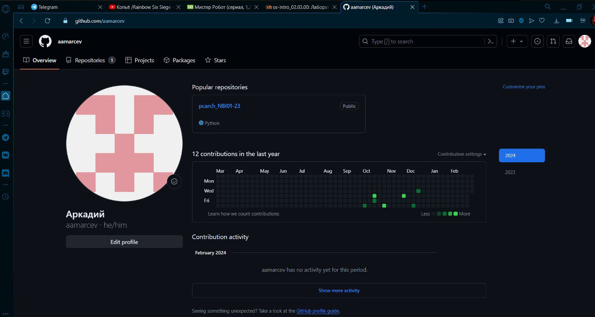

---
## Front matter
title: "Отчет по лабораторной работе №2"
subtitle: "Операционные Системы"
author: "Марцев Аркадий"

## Generic otions
lang: ru-RU
toc-title: "Содержание"

## Bibliography
bibliography: bib/cite.bib
csl: pandoc/csl/gost-r-7-0-5-2008-numeric.csl

## Pdf output format
toc: true # Table of contents
toc-depth: 2
lof: true # List of figures
lot: true # List of tables
fontsize: 12pt
linestretch: 1.5
papersize: a4
documentclass: scrreprt
## I18n polyglossia
polyglossia-lang:
  name: russian
  options:
	- spelling=modern
	- babelshorthands=true
polyglossia-otherlangs:
  name: english
## I18n babel
babel-lang: russian
babel-otherlangs: english
## Fonts
mainfont: PT Serif
romanfont: PT Serif
sansfont: PT Sans
monofont: PT Mono
mainfontoptions: Ligatures=TeX
romanfontoptions: Ligatures=TeX
sansfontoptions: Ligatures=TeX,Scale=MatchLowercase
monofontoptions: Scale=MatchLowercase,Scale=0.9
## Biblatex
biblatex: true
biblio-style: "gost-numeric"
biblatexoptions:
  - parentracker=true
  - backend=biber
  - hyperref=auto
  - language=auto
  - autolang=other*
  - citestyle=gost-numeric
## Pandoc-crossref LaTeX customization
figureTitle: "Рис."
tableTitle: "Таблица"
listingTitle: "Листинг"
lofTitle: "Список иллюстраций"
lotTitle: "Список таблиц"
lolTitle: "Листинги"
## Misc options
indent: true
header-includes:
  - \usepackage{indentfirst}
  - \usepackage{float} # keep figures where there are in the text
  - \floatplacement{figure}{H} # keep figures where there are in the text
---

# Цель работы

1.  Изучить идеологию и применение средств контроля версий.
2.  Освоить умения по работе с git.

# Задание

1.    Создать базовую конфигурацию для работы с git.
2.    Создать ключ SSH.
3.    Создать ключ PGP.
4.    Настроить подписи git.
5.    Зарегистрироваться на Github.
6.    Создать локальный каталог для выполнения заданий по предмету.

# Выполнение лабораторной работы

Для начала я запускаю в терминале супер-пользователя и устанавливаю git, чтобы использовать его функционал в терминале.

{#fig:001 width=70%}

После того, как установился git, я скачиваю gh, который упростит авторизацию и сделает возможной авторизацию через терминал.

{#fig:002 width=70%}

Задаю двумя командами имя и email владельца репозитория.

{#fig:003 width=70%}

Настраиваю utf-8 в выводе сообщений git.

{#fig:004 width=70%}

Далее я настраиваю верификацию и подпись коммитов. Задаю начальную ветку master и включаю параметры autocrlf и safecrlf.

{#fig:005 width=70%}

Создаю два secure shell ключа для верификации моего устройства. В создании этих ключей участвуют два разных алгоритма в первом случае -- rsa 4096, во втором ed25519.

{#fig:006 width=70%}

{#fig:007 width=70%}

Теперь я дополнительно создаю pgp ключ, выбирая требуемые варианты и вводя свои данные.

{#fig:008 width=70%}

Регистрирую аккаунт на гитхабе и ввожу туда свои основные данные.

{#fig:009 width=70%}

Выводим отпечаток нашего защищенного pgp ключа.

{#fig:010 width=70%}

При помощи отпечатка ключа выводим его.

{#fig:011 width=70%}

Утилитой xclip копируем его и на github в настройках выбираем добавить новый pgp ключ, вставляем его туда.

{#fig:012 width=70%}

Настраиваем автоматические подписи коммитов. Используя введенный email, указываем git применять его при подписи коммитов. 

{#fig:013 width=70%}

Авторизуемся в gh через терминал.

{#fig:014 width=70%}

Создаем папки в которые будем клонировать шаблон нашего репозитория, переходим в них. Копируем репозиторий вставляя свое имя пользователя в ссылку и клонируем его в заранее созданные папки.

{#fig:015 width=70%}

Создаем структуру курса добавляя в репозиторий папки для лабораторных работ и индивидуального проекта.

{#fig:016 width=70%}

Когда мы убедились, что структура создана, отправляем изменения на github.

{#fig:017 width=70%}

# Выводы

мы научились создавать собственные репозитории по шаблону, выполнять первоначальную настройку git и пользоваться рядом его функций.

# Контрольные вопросы

1.    Системы контроля версий (VCS) - программное обеспечение для облегчения работы с изменяющейся информацией. Они позволяют хранить несколько версий изменяющейся информации, одного и того же документа, может предоставить доступ к более ранним версиям документа. Используется для работы нескольких человек над проектом, позволяет посмотреть, кто и когда внес какое-либо изменение и т. д. VCS ррименяются для: Хранения понлой истории изменений, сохранения причин всех изменений, поиска причин изменений и совершивших изменение, совместной работы над проектами.

2.    Хранилище -- репозиторий, хранилище версий, в нем хранятся все документы, включая историю их изменения и прочей служебной информацией. commit -- отслеживание изменений, сохраняет разницу в изменениях. История -- хранит все изменения в проекте и позволяет при необходимости вернуться/обратиться к нужным данным. Рабочая копия -- копия проекта, основанная на версии из хранилища, чаще всего последней версии.

3.    Централизованные VCS (например: CVS, TFS, AccuRev) -- одно основное хранилище всего проекта. Каждый пользователь копирует себе необходимые ему файлы из этого репозитория, изменяет, затем добавляет изменения обратно в хранилище. Децентрализованные VCS (например: Git, Bazaar) -- у каждого пользователя свой вариант репозитория (возможно несколько вариантов), есть возможность добавлять и забирать изменения из любого репозитория. В отличие от классических, в распределенных (децентралиованных) системах контроля версий центральный репозиторий не является обязательным.

4.    Сначала создается и подключается удаленный репозиторий, затем по мере изменения проекта эти изменения отправляются на сервер.

5.    Участник проекта перед началом работы получает нужную ему версию проекта в хранилище, с помощью определенных команд, после внесения изменений пользователь размещает новую версию в хранилище. При этом предыдущие версии не удаляются. К ним можно вернуться в любой момент.

6.    Хранение информации о всех изменениях в вашем коде, обеспечение удобства командной работы над кодом.

7.    Создание основного дерева репозитория: git init

Получение обновлений (изменений) текущего дерева из центрального репозитория: git pull

Отправка всех произведённых изменений локального дерева в центральный репозиторий: git push

Просмотр списка изменённых файлов в текущей директории: git status

Просмотр текущих изменений: git diff

Сохранение текущих изменений: добавить все изменённые и/или созданные файлы и/или каталоги: git add .

добавить конкретные изменённые и/или созданные файлы и/или каталоги: git add имена_файлов

удалить файл и/или каталог из индекса репозитория (при этом файл и/или каталог остаётся в локальной директории): git rm имена_файлов

Сохранение добавленных изменений:

сохранить все добавленные изменения и все изменённые файлы: git commit -am 'Описание коммита'

сохранить добавленные изменения с внесением комментария через встроенный редактор: git commit

создание новой ветки, базирующейся на текущей: git checkout -b имя_ветки

переключение на некоторую ветку: git checkout имя_ветки (при переключении на ветку, которой ещё нет в локальном репозитории, она будет создана и связана с удалённой)

отправка изменений конкретной ветки в центральный репозиторий: git push origin имя_ветки

слияние ветки с текущим деревом: git merge --no-ff имя_ветки

Удаление ветки:

удаление локальной уже слитой с основным деревом ветки: git branch -d имя_ветки

принудительное удаление локальной ветки: git branch -D имя_ветки

удаление ветки с центрального репозитория: git push origin :имя_ветки

8.    git push -all отправляем из локального репозитория все сохраненные изменения в центральный репозиторий, предварительно создав локальный репозиторий и сделав предварительную конфигурацию.

9.    Ветвление - один из параллельных участков в одном хранилище, исходящих из одной версии, обычно есть главная ветка. Между ветками, т. е. их концами возможно их слияние. Используются для разработки новых функций.

10.    Во время работы над проектом могут создаваться файлы, которые не следуют добавлять в репозиторий. Например, временные файлы. Можно прописать шаблоны игнорируемых при добавлении в репозиторий типов файлов в файл .gitignore с помощью сервисов.

# Список литературы{.unnumbered}

::: {#refs}
:::
