---
## Front matter
lang: ru-RU
title: Презентация по лабораторной работе №4
subtitle: Операционные системы
author:
  - Марцев А. А.
institute:
  - Российский университет дружбы народов, Москва, Россия
date: 09 марта 2024

## i18n babel
babel-lang: russian
babel-otherlangs: english

## Formatting pdf
toc: false
toc-title: Содержание
slide_level: 2
aspectratio: 169
section-titles: true
theme: metropolis
header-includes:
 - \metroset{progressbar=frametitle,sectionpage=progressbar,numbering=fraction}
 - '\makeatletter'
 - '\beamer@ignorenonframefalse'
 - '\makeatother'
---

# Информация

## Докладчик

:::::::::::::: {.columns align=center}
::: {.column width="70%"}

  * Марцев Аркадий Алексеевич
  * Студент
  * Российский университет дружбы народов
  * [1132239100@pfur.ru]
  * <https://github.com/aamarcev/aamarcev.github.io>

:::
::: {.column width="30%"}

:::
::::::::::::::

# Вводная часть

Работа с системой общепринятых коммитов, работа и настройка gitflow.

## Актуальность

- Для работы с системой контроля версий важно понимать устройство системы семантического версионирования и общепринятых коммитов.
- Современная IT сфера всецело полагается на систему контроля версий.
- Семантическое версионирование облегчает работу с созданием проекта

## Объект и предмет исследования

- github.
- git flow.
- commitizen.

## Цели и задачи

- Научиться работать с системой продвинутых коммитов.
- Научиться работать с семантическим версионированием.

## Материалы и методы

- <https://esystem.rudn.ru/mod/page/view.php?id=1098794>

## Установка необходимого ПО

В первую очередь мы устанавливаем ПО, которое позволит нам использовать продвинутые коммиты и семантическое версионирование.

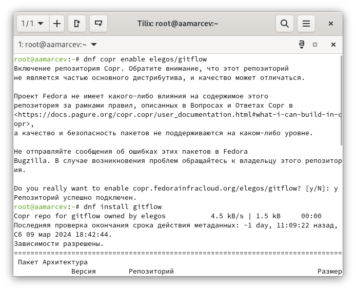{#fig:028 width=70%}

{#fig:028 width=70%}

## Настройка ПО

Далее перейдем к настройке, чтобы ПО правильно функцианировало.

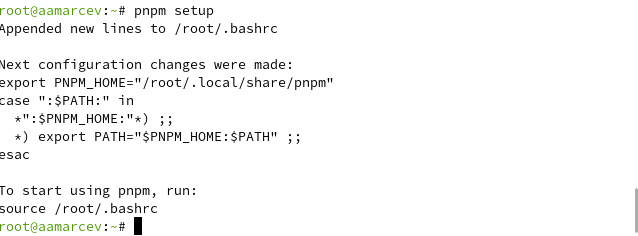{#fig:028 width=70%}

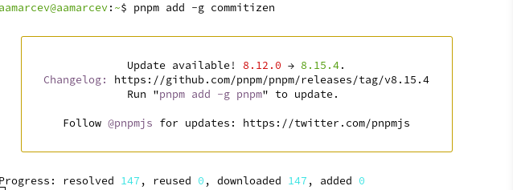{#fig:028 width=70%}

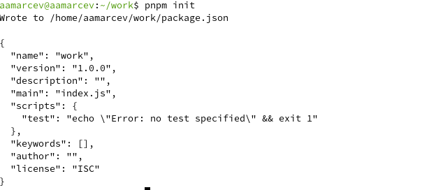{#fig:028 width=70%}

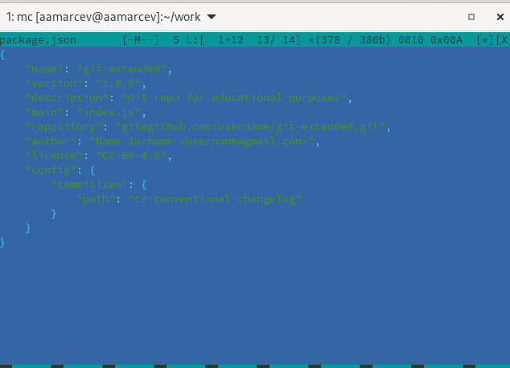{#fig:028 width=70%}

## Инициализация настроенного ПО внутри репозитория

Мы создали репозиторий на котором будем учиться работать с системой семантического версионирования и общепринятых коммитов, теперь нам нужно инициализировать это ПО внутри репозитория.

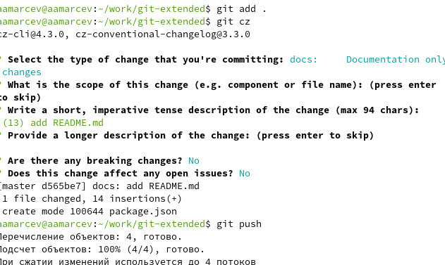{#fig:028 width=70%}

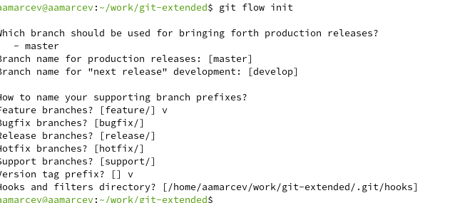{#fig:028 width=70%}

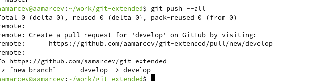{#fig:028 width=70%}

## Создание релизов

После того как мы создали и настроили ПО следует опробовать создание релизов внутри нашего тестового репозитория.

{#fig:028 width=70%}

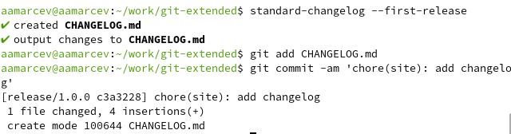{#fig:028 width=70%}

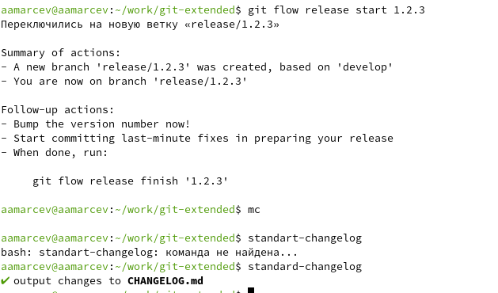{#fig:028 width=70%}

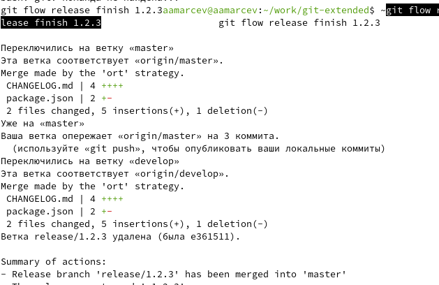{#fig:028 width=70%}

## Выводы и итог

В конце давайте отправим все сделанные изменения и релизы на сервер и подведем итоги

{#fig:028 width=70%}

В ходе работы мы научились пользоваться основными функциями общепринятых коммитов и семантического версионирования. В будущем это позволит нам более грамотно орагнизовывать свои проекты на платформе github. 

