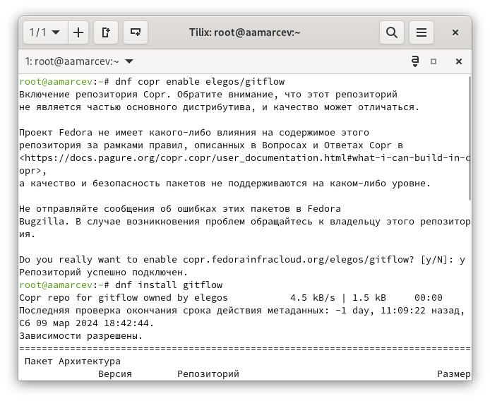
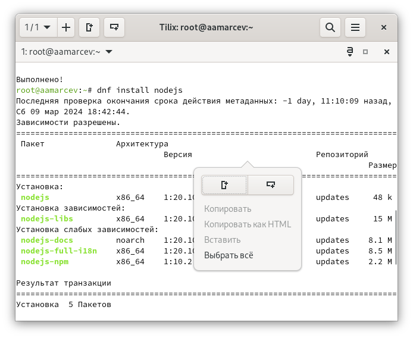
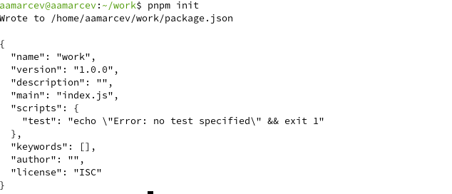
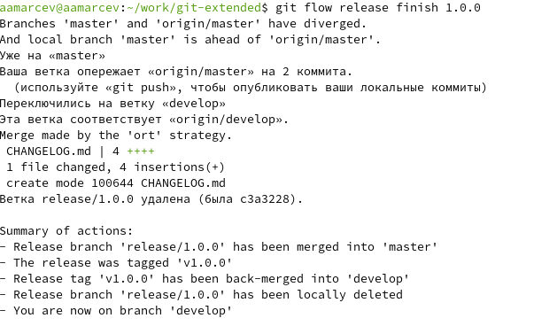
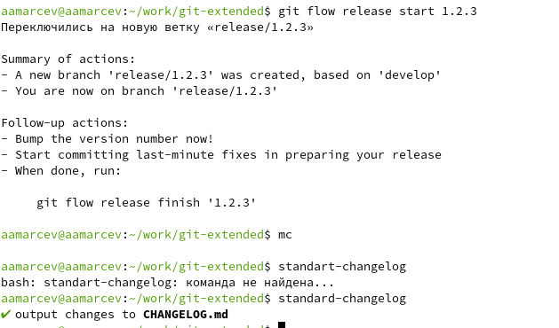
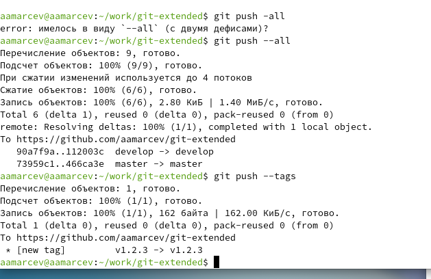

---
## Front matter
title: "Отчет по выполнению лабораторной работы №4"
subtitle: "Операционные системы"
author: "Марцев Аркадий Алексеевич"

## Generic otions
lang: ru-RU
toc-title: "Содержание"

## Bibliography
bibliography: bib/cite.bib
csl: pandoc/csl/gost-r-7-0-5-2008-numeric.csl

## Pdf output format
toc: true # Table of contents
toc-depth: 2
lof: true # List of figures
lot: true # List of tables
fontsize: 12pt
linestretch: 1.5
papersize: a4
documentclass: scrreprt
## I18n polyglossia
polyglossia-lang:
  name: russian
  options:
	- spelling=modern
	- babelshorthands=true
polyglossia-otherlangs:
  name: english
## I18n babel
babel-lang: russian
babel-otherlangs: english
## Fonts
mainfont: PT Serif
romanfont: PT Serif
sansfont: PT Sans
monofont: PT Mono
mainfontoptions: Ligatures=TeX
romanfontoptions: Ligatures=TeX
sansfontoptions: Ligatures=TeX,Scale=MatchLowercase
monofontoptions: Scale=MatchLowercase,Scale=0.9
## Biblatex
biblatex: true
biblio-style: "gost-numeric"
biblatexoptions:
  - parentracker=true
  - backend=biber
  - hyperref=auto
  - language=auto
  - autolang=other*
  - citestyle=gost-numeric
## Pandoc-crossref LaTeX customization
figureTitle: "Рис."
tableTitle: "Таблица"
listingTitle: "Листинг"
lofTitle: "Список иллюстраций"
lotTitle: "Список таблиц"
lolTitle: "Листинги"
## Misc options
indent: true
header-includes:
  - \usepackage{indentfirst}
  - \usepackage{float} # keep figures where there are in the text
  - \floatplacement{figure}{H} # keep figures where there are in the text
---

# Цель работы

Научиться работать с продвинутой системой коммитов и релизов, настроить семантическое версионирование. Получение навыков правильной работы с репозиториями git.

# Задание

1.  Выполнить работу для тестового репозитория.
2.  Преобразовать рабочий репозиторий в репозиторий с git-flow и conventional commits.

# Выполнение лабораторной работы

Для начала мы подключаем репозитории gitflow и устанавливаем его.

{#fig:001 width=70%}

Далее мы устанавливаем Nodejs на котором строятся процессы семантического версионирования и общепринятых коммитов.

{#fig:002 width=70%}

Устанавливаем pnpm для настройки Nodejs и общепринятых коммитов.

{#fig:003 width=70%}

Для дальнейшей работы нам требуется настроить Nodejs. Для этого прописываем команды pnpm setup и создается package.json .

{#fig:004 width=70%}

Добавим каталог с исполняемыми файлами, устанавливаемыми yarn, в переменную PATH. Через команду ~/aamarcev/.bashrc .

{#fig:005 width=70%}

Добавляем в pnpm программу commitzen которая нужна для редактирования общепринятых коммитов.

{#fig:006 width=70%}

Добавляем standаrt-changelog эта программа используется для создания логов изменений. 

{#fig:007 width=70%}

Создаем репозиторий git-extended для тестирования на нем git flow и общепринятых коммитов.

{#fig:008 width=70%}

Клонируем себе в директорию work созданный репозиторий.

{#fig:009 width=70%}

Делаем наш первый коммит.

{#fig:010 width=70%}

Пушим изменения в хранилище

{#fig:011 width=70%}

Инициализируем систему общепринятых коммитов при помощи pnpm

{#fig:012 width=70%}

Заполняем параметры пакета. Изменяем лицензию pnpm, название пакета, автора и репозиторий

{#fig:013 width=70%}

Добавляем новые файлы

{#fig:014 width=70%}

Делаем коммит через commitzen

{#fig:015 width=70%}

Инициализируем систему семантического версионирования git flow. Это нужно для создания релизов.

{#fig:016 width=70%}

Проверяем в какой ветке мы находимся, для этого прописываем команду git branch.

{#fig:017 width=70%}

Пушим весь репозиторий в хранилище

{#fig:018 width=70%}

Устанавливаем ветку как вышестоящую, для того чтоб переносить изменения в main ветку.

{#fig:019 width=70%}

Создаем тестовый релиз с версией 1.0.0 с помощью git flow 

{#fig:020 width=70%}

Создаем журнал изменений, он нужен чтобы отслеживать изменения в нашем проекте. Далее добавляем журнал изменений в индекс.

{#fig:021 width=70%}

Завершаем создание релиза и просходит слияние веток develop и main все изменения в ветке develop подгружаются в main.

{#fig:022 width=70%}

отправляем все последние изменения в хранилище github.

{#fig:023 width=70%}

Создадим релиз на github, используя утилиты для работы с github

{#fig:024 width=70%}

Создадим релиз версии v1.2.3. Добавим журнал изменений в индекс.

{#fig:025 width=70%}

Завершим релиз и зальем релизную ветку в основную.

{#fig:026 width=70%}

Отправим все новые изменения и индексы в хранилище

{#fig:027 width=70%}

Создадим релиз на github с комментариями журнала изменений.

{#fig:028 width=70%}

# Выводы

В ходе проделанной работы я приобрел навыки работы с системой семантического версионирования и с общепринятыми коммитами и релизами gitflow.

# Список литературы{.unnumbered}

::: {#https://esystem.rudn.ru/mod/page/view.php?id=1098794}
:::  
