---
## Front matter
title: "Отчет по лабораторной работе №5"
subtitle: "Операционные системы"
author: "Марцев Аркадий Алексеевич"

## Generic otions
lang: ru-RU
toc-title: "Содержание"

## Bibliography
bibliography: bib/cite.bib
csl: pandoc/csl/gost-r-7-0-5-2008-numeric.csl

## Pdf output format
toc: true # Table of contents
toc-depth: 2
lof: true # List of figures
lot: true # List of tables
fontsize: 12pt
linestretch: 1.5
papersize: a4
documentclass: scrreprt
## I18n polyglossia
polyglossia-lang:
  name: russian
  options:
	- spelling=modern
	- babelshorthands=true
polyglossia-otherlangs:
  name: english
## I18n babel
babel-lang: russian
babel-otherlangs: english
## Fonts
mainfont: PT Serif
romanfont: PT Serif
sansfont: PT Sans
monofont: PT Mono
mainfontoptions: Ligatures=TeX
romanfontoptions: Ligatures=TeX
sansfontoptions: Ligatures=TeX,Scale=MatchLowercase
monofontoptions: Scale=MatchLowercase,Scale=0.9
## Biblatex
biblatex: true
biblio-style: "gost-numeric"
biblatexoptions:
  - parentracker=true
  - backend=biber
  - hyperref=auto
  - language=auto
  - autolang=other*
  - citestyle=gost-numeric
## Pandoc-crossref LaTeX customization
figureTitle: "Рис."
tableTitle: "Таблица"
listingTitle: "Листинг"
lofTitle: "Список иллюстраций"
lotTitle: "Список таблиц"
lolTitle: "Листинги"
## Misc options
indent: true
header-includes:
  - \usepackage{indentfirst}
  - \usepackage{float} # keep figures where there are in the text
  - \floatplacement{figure}{H} # keep figures where there are in the text
---

# Цель работы

Настройка рабочей среды, установка ПО для менеджмента паролей.

# Задание

- Установка менеджера паролей pass и chemzoi.
- Настройка установленного ПО.

# Выполнение лабораторной работы

Сначала установим pass.

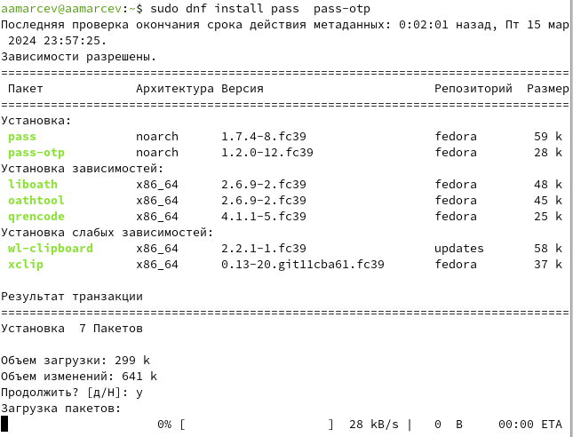{#fig:001 width=70%}

Проверяем наличие gpg ключей. Которые будут использоваться для связи pass с нашим репозиторием.

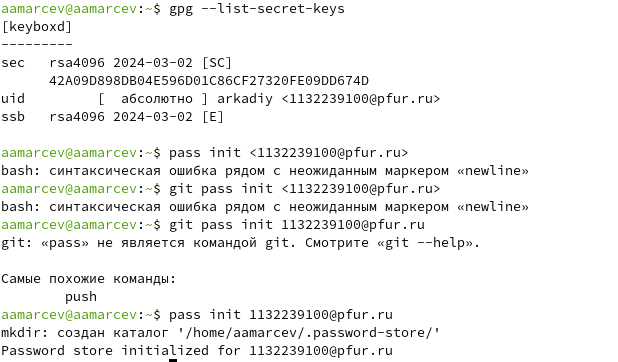{#fig:002 width=70%}

Инициализируем пустой репозиторий для паролей pass.

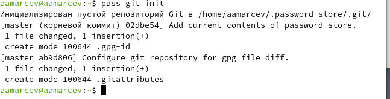{#fig:003 width=70%}

Добавляем браузерное расширение обеспечивающее интерфейс native messaging.

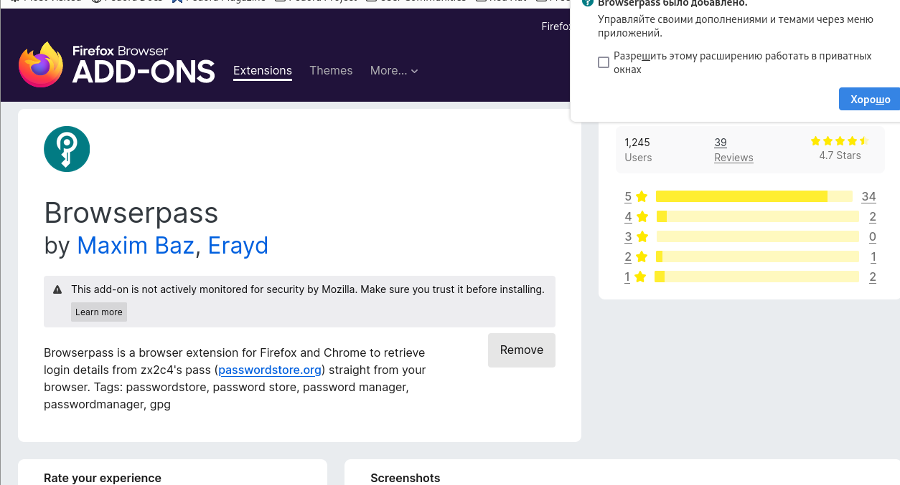{#fig:004 width=70%}

Подключаем репозиторий, из которого будем устанавливать ПО для связи с браузером.

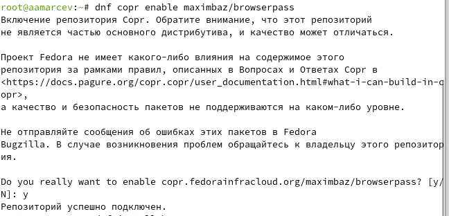{#fig:005 width=70%}

Устанавливаем browserpass.

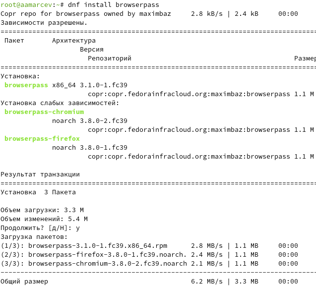{#fig:006 width=70%}

Создадим тестовый пароль psswd1 через pass и укажем его расположение.

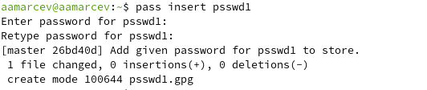{#fig:007 width=70%}

Просматриваем наш пароль.

{#fig:008 width=70%}

Изменим наш созданный пароль, на тот, что сгенерирует утилита pass.

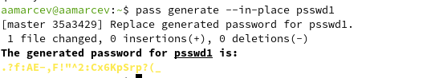{#fig:009 width=70%}

Установим дополнительное программное обеспечение.

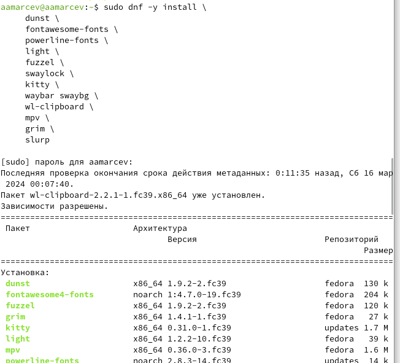{#fig:010 width=70%}

Установим шрифты.

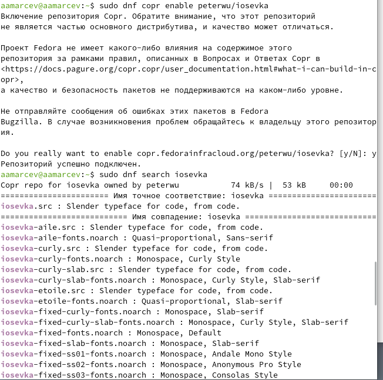{#fig:011 width=70%}

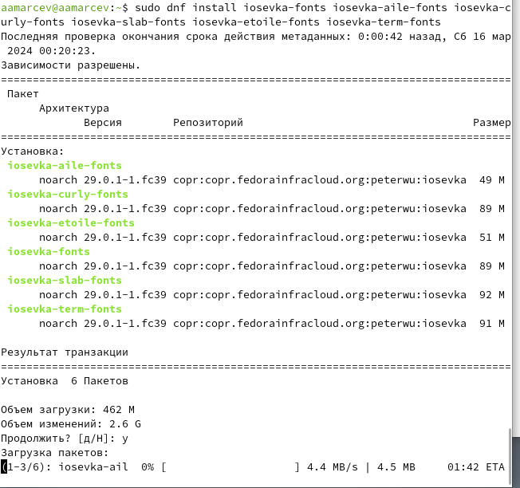{#fig:012 width=70%}

Установим бинарный файл для chezmoi. Он автоматически определит архитектуру процессора и операционную систему.

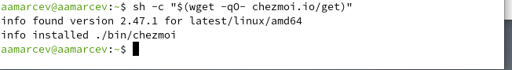{#fig:013 width=70%}

Создадим свой частный репозиторий для конфигурационных файлов на основе шаблона. Все это делаем при помощи утилит для работы с github через терминал.

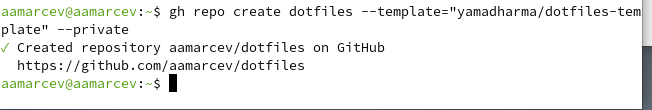{#fig:014 width=70%}

Инициализируем chezmoi с нашим репозиторием dotflies.

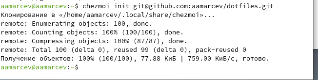{#fig:015 width=70%}

Смотрим какие изменения внесет chezmoi в наш домашний каталог при помощи chezmoi diff.

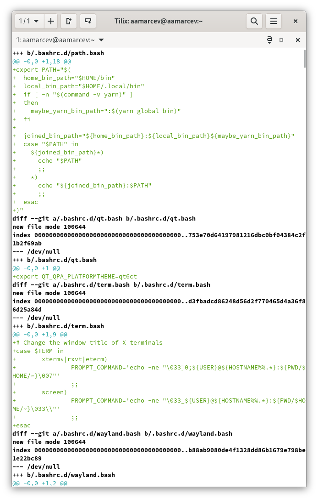{#fig:016 width=70%}

Принимаем изменения.

{#fig:017 width=70%}

Проверяем работает ли у нас функционал chezmoi для ежедневной работы с этой программой.

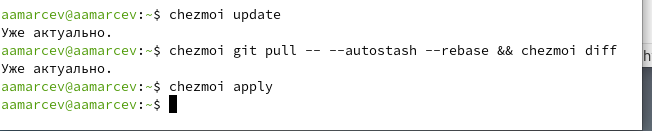{#fig:018 width=70%}

Подключаем в конфигурационном файле chezmoi автокоммит и автопуш.

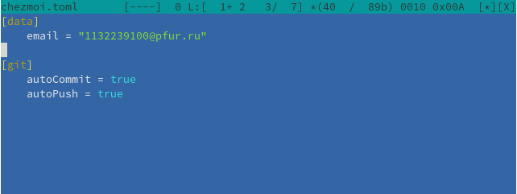{#fig:019 width=70%}

# Выводы

В ходе этой лабораторной работы мы установили ПО для менеджмента паролей и настроили нашу рабочую среду.

# Список литературы{.unnumbered}

::: {https://esystem.rudn.ru/mod/page/view.php?id=1098796#org9224f1a}
:::
