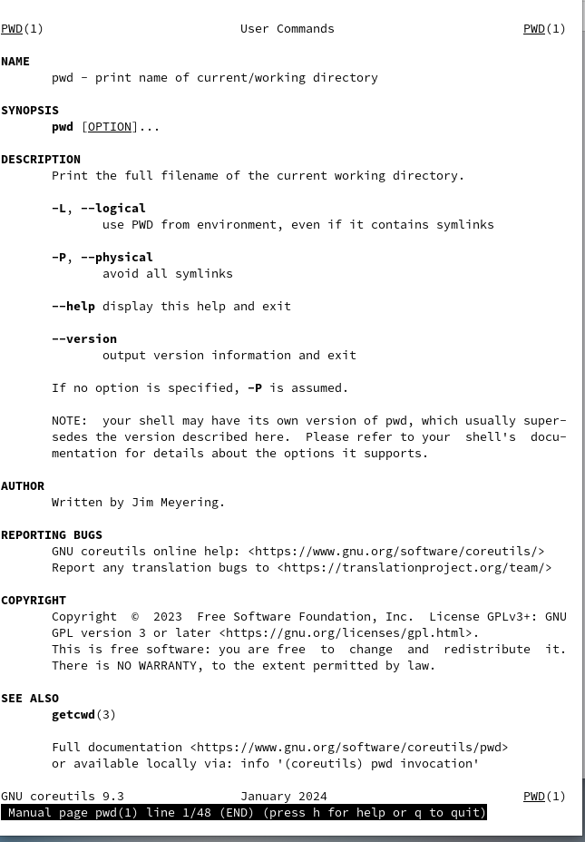

---
## Front matter
lang: ru-RU
title: Презентация по выполнению лабораторной работы №6
subtitle: Операционные системы
author:
  - Марцев Аркадий Алексеевич
institute:
  - РУДН
date: 13 Марта 2023

## i18n babel
babel-lang: russian
babel-otherlangs: english

## Formatting pdf
toc: false
toc-title: Содержание
slide_level: 2
aspectratio: 169
section-titles: true
theme: metropolis
header-includes:
 - \metroset{progressbar=frametitle,sectionpage=progressbar,numbering=fraction}
 - '\makeatletter'
 - '\beamer@ignorenonframefalse'
 - '\makeatother'
---

# Информация

## Докладчик

:::::::::::::: {.columns align=center}
::: {.column width="70%"}

  * Марцев Аркадий Алексеевич
  * Студент
  * Российский университет дружбы народов
  * [1132239100@pfur.ru](mailto:1132239100@pfur.ru)
  * <https://aamarcev.github.io/ru/>

:::
::: {.column width="30%"}

:::
::::::::::::::

# Тема презентации

Основы интерфейса взаимодействия пользователя с системой Unix на уровне командной строки.

# Актуальность

- В рабочей среде в IT взаимодействие с ОС Linux на продвинутом уровне, часто, одно из основных требований.
- Для выполнения дальнейшей работы на курсе "Архитектура компьютеров и операционные системы", нам нужно будет использовать те знания которые мы получим в ходе этой работы.
- Для ознакомления и взаимодействия с ОС на базе ядра Unix важно уметь пользоваться терминалом.

# Задание 

1. Найти полное имя домашней директории.
2. Выполнить действия с командой ls.
3. Выполнить действия с командой mkdir, rmdir, rm.
4. Получить мануалы по использованию команд с помощью команды man. 
5. Используя полученную информацию использовать раннее использованные команды со специальным ключом.

# Полное имя домашней директории

Для нахождения полного имени домашней директории пользуемся командой pwd.

{#fig:001 width=70%}

# Действия с командой ls

При помощи команды ls мы можем выводить на экран содержимое директории, в которой находится пользователь.

{#fig:002 width=70%}

# Ключи команды ls

Также при помощи ключей к командам мы можем использовать их дополнительные функции, так на представленном слайде при помощи ключа -alF мы выводим полное содержимое директории с дополнительной информацией о каждом элементе.

{#fig:004 width=70%}

# mkdir

Команда mkdir нужна для создания новых директорий. С её помощью создаем директорию newdir а в ней поддиректорию morefun.

{#fig:005 width=70%}

# rmdir и rm

rmdir и rm используются для удаления пустых директорий и удаления любых элементов соответственно. В данном случае используется ключ рекурсивного удаления -r так как newdir не пустая директория.

{#fig:008 width=70%}

# Получение мануалов при помощи команды man  

Команда man позволяет нам получить мануал к любой другой команде, в котором будет обьясняться как используется команды и какие ключи у неё есть. Так в лабораторной мы получили мануалы для команд cd, pwd mkdir, rmdir и rm.

{#fig:013 width=70%}

# Использование команд со специальным ключом

Получив список ключей к некоторым командам мы можем модифицировать их и использовать их особые свойства. Например в данном случае мы используем команду mkdir -p для создания директории и поддиректории в ней одновременно. 

{#fig:017 width=70%}

# Итог и выводы

В ходе этой лабораторной работы мы научились взаимодействовать с файловой системой Linux при помощи терминала.

