---
## Front matter
title: "Лабораторная работа №6"
subtitle: "Операционные системы"
author: "Марцев Аркадий Алексеевич"

## Generic otions
lang: ru-RU
toc-title: "Содержание"

## Bibliography
bibliography: bib/cite.bib
csl: pandoc/csl/gost-r-7-0-5-2008-numeric.csl

## Pdf output format
toc: true # Table of contents
toc-depth: 2
lof: true # List of figures
lot: true # List of tables
fontsize: 12pt
linestretch: 1.5
papersize: a4
documentclass: scrreprt
## I18n polyglossia
polyglossia-lang:
  name: russian
  options:
	- spelling=modern
	- babelshorthands=true
polyglossia-otherlangs:
  name: english
## I18n babel
babel-lang: russian
babel-otherlangs: english
## Fonts
mainfont: PT Serif
romanfont: PT Serif
sansfont: PT Sans
monofont: PT Mono
mainfontoptions: Ligatures=TeX
romanfontoptions: Ligatures=TeX
sansfontoptions: Ligatures=TeX,Scale=MatchLowercase
monofontoptions: Scale=MatchLowercase,Scale=0.9
## Biblatex
biblatex: true
biblio-style: "gost-numeric"
biblatexoptions:
  - parentracker=true
  - backend=biber
  - hyperref=auto
  - language=auto
  - autolang=other*
  - citestyle=gost-numeric
## Pandoc-crossref LaTeX customization
figureTitle: "Рис."
tableTitle: "Таблица"
listingTitle: "Листинг"
lofTitle: "Список иллюстраций"
lotTitle: "Список таблиц"
lolTitle: "Листинги"
## Misc options
indent: true
header-includes:
  - \usepackage{indentfirst}
  - \usepackage{float} # keep figures where there are in the text
  - \floatplacement{figure}{H} # keep figures where there are in the text
---

# Цель работы

Приобретение практических навыков взаимодействия пользователя с системой по-
средством командной строки.

# Задание

1. Найти полное имя домашней директории.
2. Выполнить действия с командой ls.
3. Выполнить действия с командой mkdir, rmdir, rm.
4. Получить мануалы по использованию команд с помощью команды man. 
5. Используя полученную информацию использовать раннее использованные команды со специальным ключом.

# Выполнение лабораторной работы
 
 Для начала узнаем полное имя нашей домашней директории при помощи команды pwd.
 
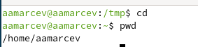{#fig:001 width=70%}

Переходим в каталог tmp там используем команду вывода содержимого ls в трех вариантах: стандартном ls, вывод полного содержимого включая все скрытые файлы ls -а и варианте выводящем только директории ls -dir.

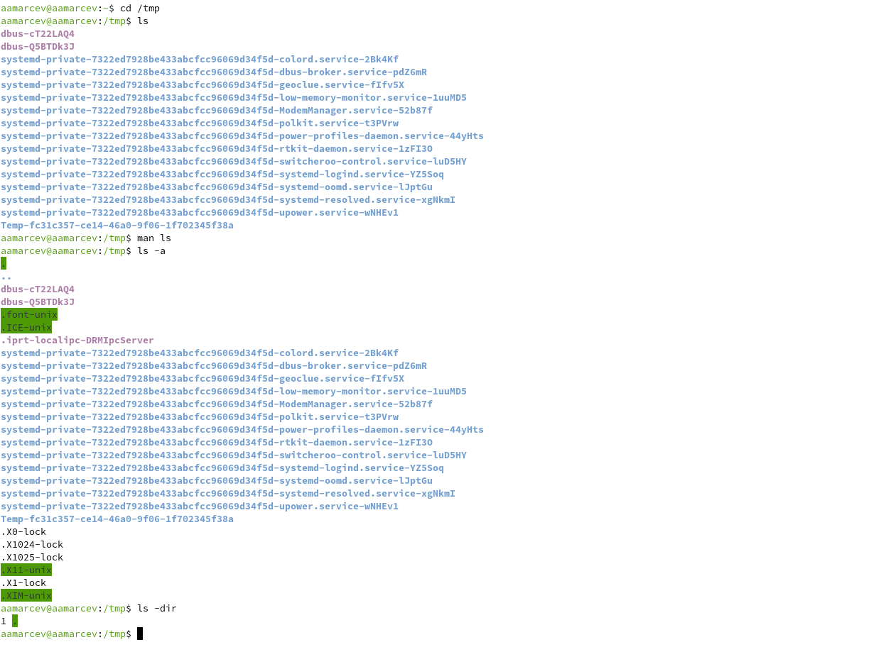{#fig:002 width=70%}

Переходим в каталог var/spool и при помощи команды ls со специальным ключом выводим все поддиректории для того чтобы найти cron которого там не оказывается.

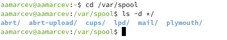{#fig:003 width=70%}

Переходим в домашний каталог и при помощи ключа -alF для команды вывода содержимого получаем полную информацию по все каталогам и подкаталогам, следовательно получаем и информацию о владельце.

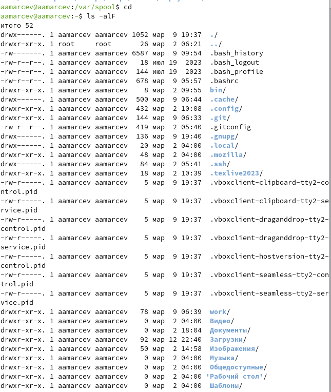{#fig:004 width=70%}

Создаем в домашнем каталоге директорию newdir в ней поддиректорию morefun.

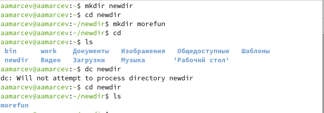{#fig:005 width=70%}

Создаем сразу несколько директорий memo misc и letters и одной командой rm с ключом -r удаляем их.

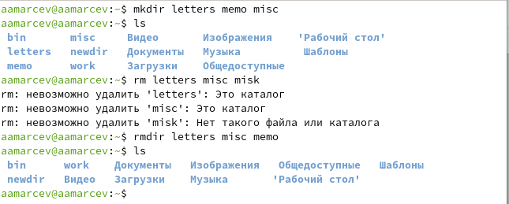{#fig:006 width=70%}

Пробуем удалить раннее созданный каталог newdir командой rm. Это не получается, т.к. это каталог и даже rmdir не дало бы его удалить потому что он не пустой.

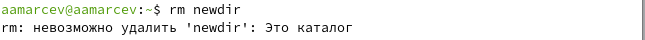{#fig:007 width=70%}

Для того чтоб удалить наш каталог нам нужно будет воспользоваться ключом рекурсивного удаления -r и тогда все сработает.

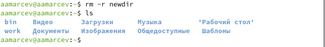{#fig:008 width=70%}

Открываем мануал к команде ls при помощи команды man, в нем находим ключ -R который позволит нам при вводе команды видеть не только содержимое каталога, но и её подкаталогов.

{#fig:009 width=70%}

Аналогично открываем мануал команды и просматриваем его. Понимаем, что для получения требуемого результата придется использовать коомбинацию ключей -t вывода с сортировкой по времени создания и -l для вывода более полной информации.

{#fig:010 width=70%}

{#fig:011 width=70%}

С помощью команды man открываю мануалы к следующим командам: cd pwd mkdir rmdir rm и просматриваю их и их ключи.

1.    -P - позволяет следовать по символическим ссылкам перед тем, как обработаны все переходы '..'
2.    -L - переходит по символическим ссылкам только после того, как обработаны все переходы ".."
3.    -e - позволяет выйти с ошибкой, если диреткория, в которую нужно перейти, не найдена.

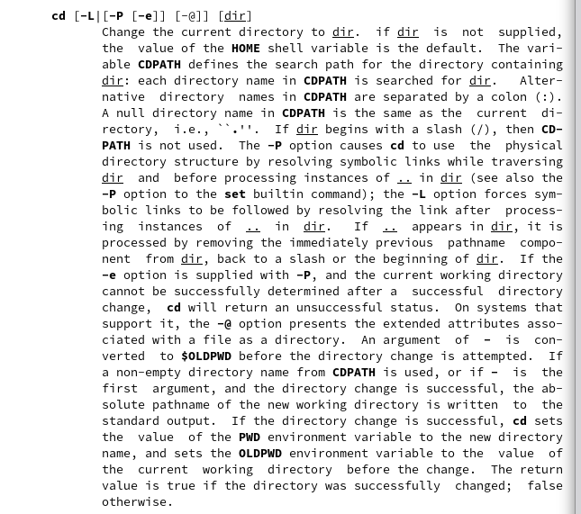{#fig:012 width=70%}

1.      -L - брать директорию из переменной окружения, даже если она содержит символические ссылки.
2.      -P - отбрасывать все символические ссылки.

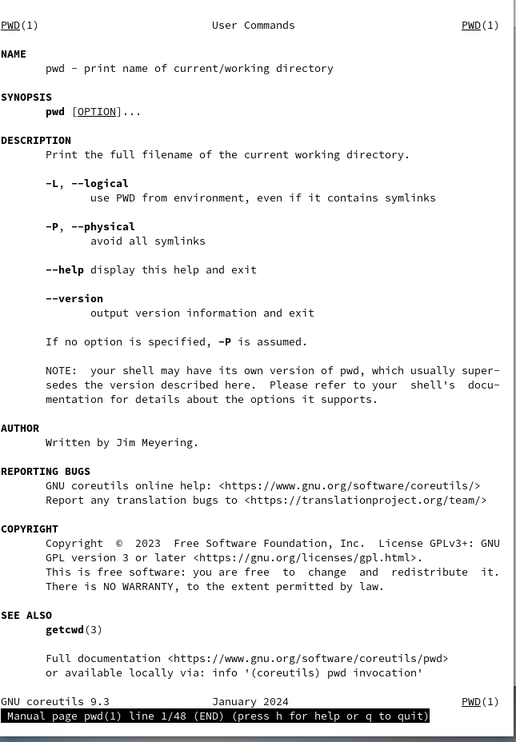{#fig:013 width=70%}

1.    -m - устанавливает права доступа создаваемой директории как chmod, синтаксис тоже как у chmod.
2.    -p - позволяет рекурсивно создавать директории и их подкаталоги
3.    -v - выводи сообщение о созданных директориях
4.    -z - установить контекст SELinux для создаваемой директории по умолчанию
5.    -context - установить контекст SELinux для создаваемой директории в значении CTX

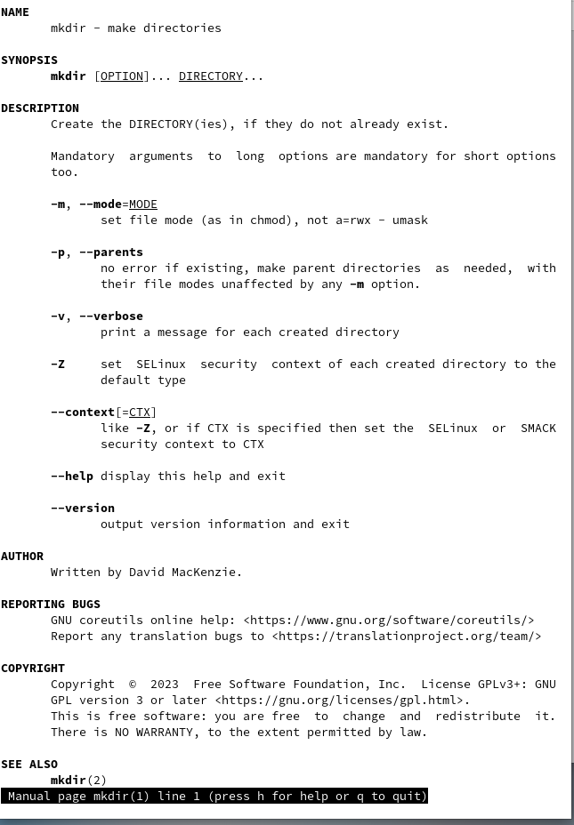{#fig:014 width=70%}

1.    --ignore-fail-on-non-empty - отменяет вывод ошибки, если каталог не пустой, просто его игнорирует
2.    -p - удаляет рекурсивно каталоги, если они все содержат в себе только удаляемый каталог
3.    -v - выводит сообщение о каждом удалении директории.

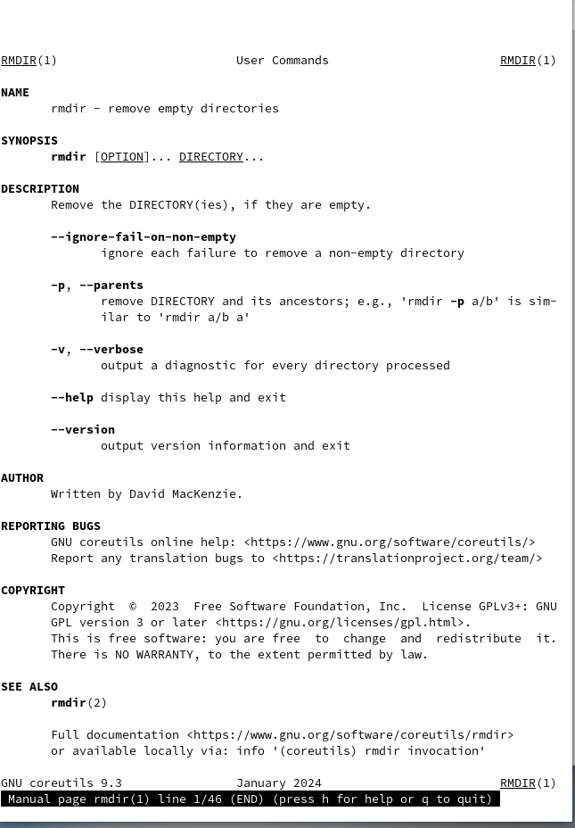{#fig:015 width=70%}

1.    -f - игнорировать несуществующие файлы или аргументы, никогда не выводить запрос на подтверждение удаления
2.    -i - выводить запрос на подтверждение удаления каждого файла
3.    -I - вывести запрос на подтверждение удаления один раз, для всех файлов, если удаляется больше 3-х файлов или идет рекурсивное удаление
4.    --interactive - заменяет предыдущие три опции, можно выбрать одну из них.
5.    --one-file-system - во время рекурсивного удаления пропускать директории из других файловых систем
6.    --no-preserve-root если в качестве директории задана корневая, то считать что это обычная директория и начать удаление.
7.    -r, -R - удаляет директории их содержимое рекурсивно
8.    -d, --dir - удаляет пустые директории
9.    -v - прописывает все действия команды

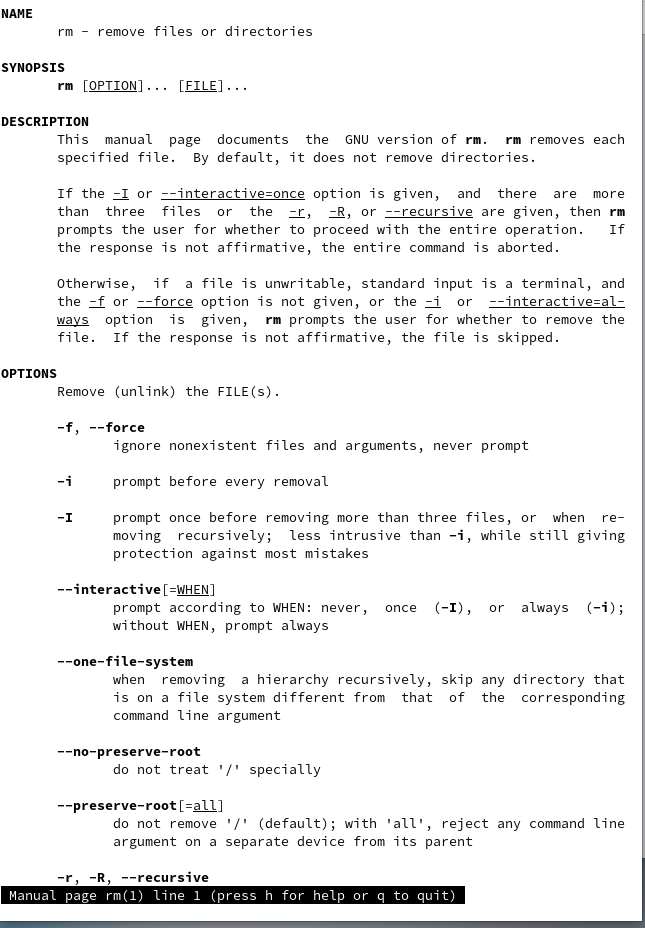{#fig:016 width=70%}

С помощью команды history просматриваю список использованных команд и выбираю две, которые буду модифицировать с помощью ключей. Так первой я выбрал mkdir с ключом -p для создания директорий не по одной, а по цепочке.

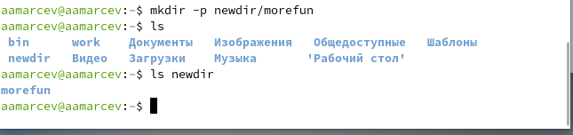{#fig:017 width=70%}

И команду ls с ключом -la для вывода полной информации о всех (в том числе и скрытых) файлах.

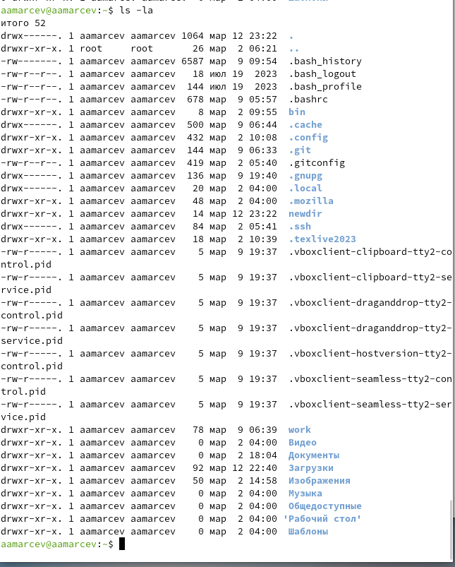{#fig:018 width=70%}

# Выводы

# Контрольные вопросы

1.    Командная строка - это текстовая система, которая передает команды компьютеру и возвращает результаты пользователю. В операционной системе типа Linux взаимодействие пользователя с системой обычно осуществляется с помощью командной строки посредством построчного ввода команд.
2.    Для определения абсолютного пути к текущему каталогу используется команда pwd. Например: если я введу pwd в своем домашнем каталоге то получу /home/aamarcev .
3.    С помощью команды ls можно определить имена файлов, при помощи опции -F уже мы сможем определить тип файлов, если нам необходимы скрытые файлы, добавим опцию -a. Пример есть в лабораторной работе.
4.    С помощью команды ls можно определить имена файлов, если нам необходимы скрытые файлы, добавим опцию -a. Пример есть в лабораторной работе.
5.    rmdir по умолчанию удаляет пустые каталоги, не удаляет файлы. rm удаляет файлы, без дополнительных опций (-d, -r) не будет удалять каталоги. Удалить в одной строчке одной командой можно файл и каталог. Если файл находится в каталоге, используем рекурсивное удаление, если файл и каталог не связаны подобным образом, то добавим опцию -d, введя имена через пробел после утилиты.
6.    Вывести информацию о последних выполненных пользователем команд можно с помощью history. Пример приведет в лабораторной работе.
7.    Используем синтаксис !номеркоманды в выводе history:s/что заменяем/на что заменяем Примеры приведены в лабораторной работе.
8.    Если я введу "cd ; ls", то окажусь в домашнем каталоге и получу вывод файлов внутри него.
9.    Символ экранирования - (обратный слеш) добавление перед спецсимволом обратный слеш, чтобы использовать специальный символ как обычный. Также позволяет читать системе название директорий с пробелом. Пример: cd work/Операционные\ системы/
10.    Опция -l позволит увидеть дополнительную информацию о файлах в каталоге: время создания, владельца, права доступа
11.    Относительный путь к файлу начинается из той директории, где вы находитесь (она сама не прописывается в пути), он прописывается относительно данной директории. Абсолютный путь начинается с корневого каталога.
12.    Использовать man <имя команды> или <имя команды> --help
13.    Клавиша Tab.

