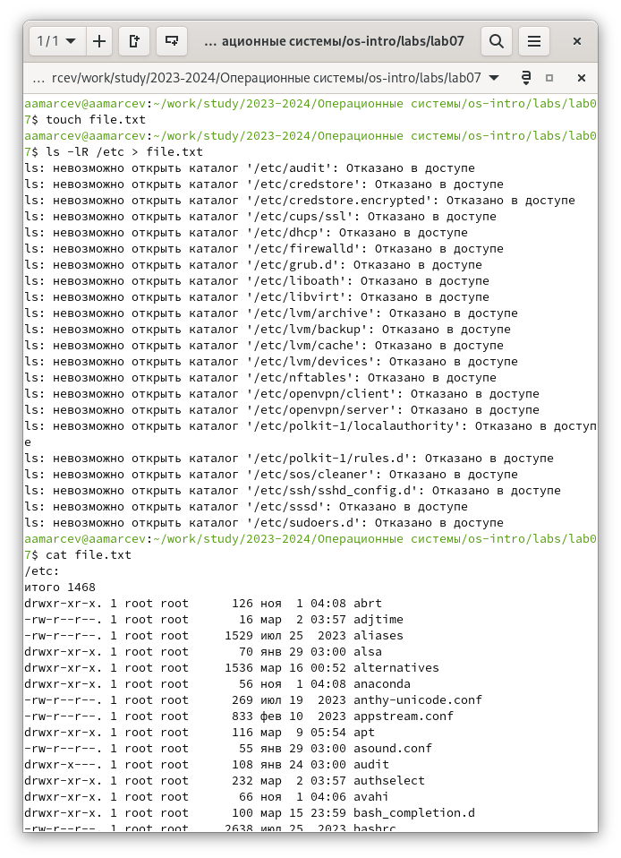
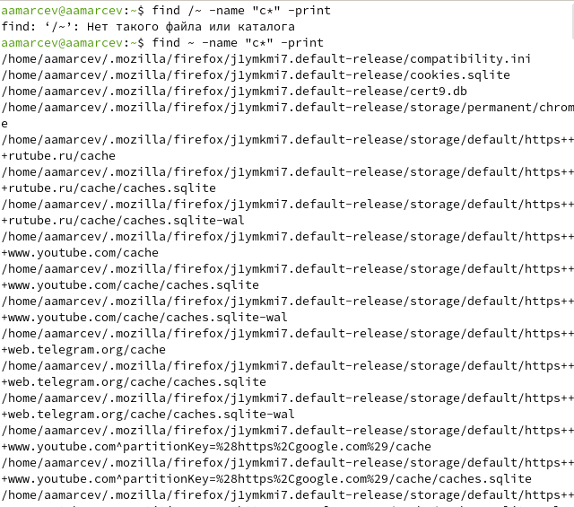
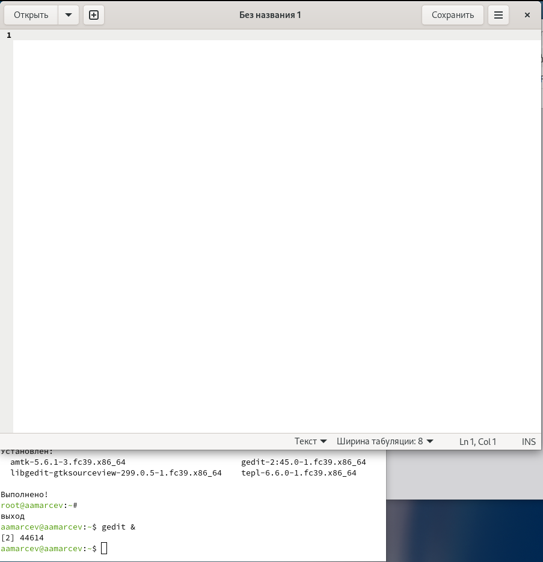
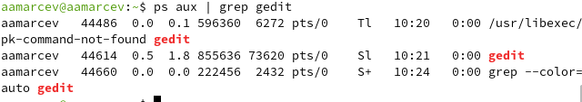
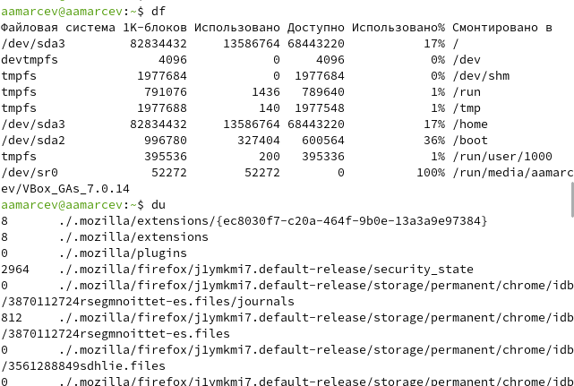

---
## Front matter
lang: ru-RU
title: Презентация по лабораторной работе №8
subtitle: Операционные системы
author:
  - Марцев А. А. 
institute:
  - Российский университет дружбы народов, Москва, Россия
date: 30 марта 2024

## i18n babel
babel-lang: russian
babel-otherlangs: english

## Formatting pdf
toc: false
toc-title: Содержание
slide_level: 2
aspectratio: 169
section-titles: true
theme: metropolis
header-includes:
 - \metroset{progressbar=frametitle,sectionpage=progressbar,numbering=fraction}
 - '\makeatletter'
 - '\beamer@ignorenonframefalse'
 - '\makeatother'
---

# Информация

## Докладчик

:::::::::::::: {.columns align=center}
::: {.column width="70%"}

  * Марцев Аркадий Алексеевич
  * Студент
  * Российский университет дружбы народов
  * [1132239100@pfur.ru](mailto:1132239100@pfur.ru)
  * <https://aamarcev.github.io/ru/>

:::
::: {.column width="30%"}

:::
::::::::::::::

# Вводная часть

## Актуальность

- Актуально для работы с Linux без графического интерфейса.
- Получение новых практических навыков для работы с ОС Linux. 
- Будет полезно для выполнения дальнейших лабораторных работ.

## Объект и предмет исследования

- Управление операторами ввода и вывода через терминал. Запись и чтение из файла. Фильтрация текстовых данных. Управление процессами.

# Цель работы

    Ознакомление с инструментами поиска файлов и фильтрации текстовых данных.
Приобретение практических навыков: по управлению процессами (и заданиями), по
проверке использования диска и обслуживанию файловых систем.

# Задание

- Работа с текстом. Направить ввод и вывод по определенным критериям. Поиск среди текста.
- Управление процессами. Запуск процессов в фоновом режиме и их терминация.
- Просмотр и управление памятью.

## Выполнение лабораторной работы

# Направление ввода

На данном скриншоте мы направляем ввод в созданный файл text.txt. Мы записываем в него все файлы из каталога /etc.

{#fig:001 width=70%}

# Поиск по имени

Для поиска по имени мы можем использовать команду find тут например мы ищем в домашнем каталоге имена всех файлов начинающихся с "с". 

{#fig:001 width=70%}

# Запуск фонового процесса

Для того чтобы запустить фоновый процесс через терминал используется символ & так мы запускаем редактор gedit в фоновом режиме.

{#fig:001 width=70%}

# Идентификационные номера процессов

Для того чтобы взаимодействовать с процессом, нам нужно получить его идентификационный номер. Это мы и делаем командой ps aux. А вывод именно требуемой информации через команду grep.

{#fig:001 width=70%}

# Терминация процессов

Для того чтобы остановить фоновые процессы мы используем команду kill но для того чтобы указать что именно нам нужно остановить этой командой нам нужен идентификационный номер процесса, который мы, например, получили раннее.

{#fig:001 width=70%}

# Проверка используемой памяти

Команды df и du служат для просмотра используемой памяти каждым файлом. Их мы и вводим.

{#fig:001 width=70%}

# Результаты

## Выводы

В ходе данной лабораторной работы, мы приобрели практические навыки работы с текстовыми файлами, направлением ввода и вывода в них. А также работе и контролем процессов.

Благодарю за внимание.
