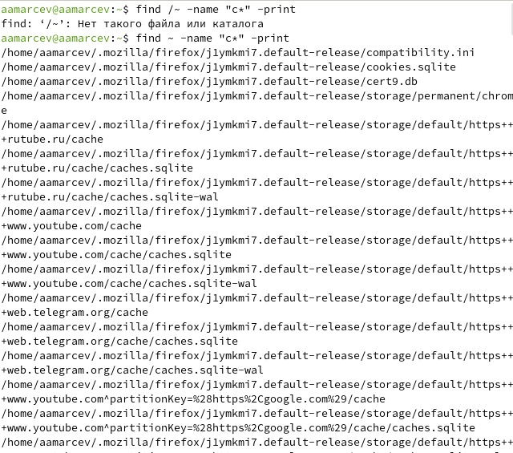

---
## Front matter
title: "Отчет по лабораторной работе №8"
subtitle: "Операционные системы"
author: "Марцев Аркадий Алексеевич"

## Generic otions
lang: ru-RU
toc-title: "Содержание"

## Bibliography
bibliography: bib/cite.bib
csl: pandoc/csl/gost-r-7-0-5-2008-numeric.csl

## Pdf output format
toc: true # Table of contents
toc-depth: 2
lof: true # List of figures
lot: true # List of tables
fontsize: 12pt
linestretch: 1.5
papersize: a4
documentclass: scrreprt
## I18n polyglossia
polyglossia-lang:
  name: russian
  options:
	- spelling=modern
	- babelshorthands=true
polyglossia-otherlangs:
  name: english
## I18n babel
babel-lang: russian
babel-otherlangs: english
## Fonts
mainfont: PT Serif
romanfont: PT Serif
sansfont: PT Sans
monofont: PT Mono
mainfontoptions: Ligatures=TeX
romanfontoptions: Ligatures=TeX
sansfontoptions: Ligatures=TeX,Scale=MatchLowercase
monofontoptions: Scale=MatchLowercase,Scale=0.9
## Biblatex
biblatex: true
biblio-style: "gost-numeric"
biblatexoptions:
  - parentracker=true
  - backend=biber
  - hyperref=auto
  - language=auto
  - autolang=other*
  - citestyle=gost-numeric
## Pandoc-crossref LaTeX customization
figureTitle: "Рис."
tableTitle: "Таблица"
listingTitle: "Листинг"
lofTitle: "Список иллюстраций"
lotTitle: "Список таблиц"
lolTitle: "Листинги"
## Misc options
indent: true
header-includes:
  - \usepackage{indentfirst}
  - \usepackage{float} # keep figures where there are in the text
  - \floatplacement{figure}{H} # keep figures where there are in the text
---

# Цель работы

    Ознакомление с инструментами поиска файлов и фильтрации текстовых данных.
Приобретение практических навыков: по управлению процессами (и заданиями), по
проверке использования диска и обслуживанию файловых систем.

# Задание

- Работа с текстом. Направить ввод и вывод по определенным критериям. Поиск среди текста.
- Управление процессами. Запуск процессов в фоновом режиме и их терминация.
- Просмотр и управление памятью.

# Выполнение лабораторной работы

Заходим в систему под нужным нам пользователем.

{#fig:001 width=70%}

Создаем файл text.txt и записываем в него все названия файлов из каталога /etc.

{#fig:002 width=70%}

Просматриваем все файлы с расширением .conf в файле text.txt при помощи команды grep.

{#fig:003 width=70%}

Создаю файл conf.txt в него записываю все файлы с расширением .conf из раннее созданного файла text.txt.

{#fig:004 width=70%}

Нахожу в домашнем каталоге все файлы название которых начинаются с "с" и вывожу их названия на экран.

{#fig:005 width=70%}

По аналогии выводим все файлы начинающиеся с "h" из каталога /etc постранично.

{#fig:006 width=70%}

Настраиваю фоновый процесс записи всех файлов начинающихся c "log" в logfile.

{#fig:007 width=70%}

Удаляю logfile.

{#fig:008 width=70%}

Запускаю как фоновый процесс текстовый редактор gedit.

{#fig:009 width=70%}

С помощью команды ps aux и grep я получаю идентификационный номер процесса при помощи которого происходит все взаимодействие с процессом.

{#fig:010 width=70%}

Просматриваю мануал к команде kill.

{#fig:011 width=70%}

Использую идентификационный номер процесса gedit и команду kill для того чтоб его остановить.

{#fig:012 width=70%}

Просмотр мануала к команде df.

{#fig:013 width=70%}

Просмотр мануала к команде du.

{#fig:014 width=70%}

Прописываю команды df и du, которые используются для просмотра используемой памяти.

{#fig:015 width=70%}

Использую команду find и поиск по типу для того чтобы вывести все названия директорий и поддиректорий в домашнем каталоге.

{#fig:016 width=70%}

# Выводы

В ходе данной лабораторной работы, мы приобрели практические навыки работы с текстовыми файлами, направлением ввода и вывода в них. А также работе и контролем процессов.

# Ответ на контрольные вопросы

1.    Какие потоки ввода вывода вы знаете? В системе по умолчанию открыто три специальных потока: – stdin — стандартный поток ввода (по умолчанию: клавиатура), файловый дескриптор 0; – stdout — стандартный поток вывода (по умолчанию: консоль), файловый дескриптор 1; – stderr — стандартный поток вывод сообщений об ошибках (по умолчанию: консоль), файловый дескриптор 2.

2.    Объясните разницу между операцией > и ». Этот знак > - перенаправление ввода/вывода, а » - перенаправление в режиме добавления.

3.    Что такое конвейер? Конвейер (pipe) служит для объединения простых команд или утилит в цепочки, в которых результат работы предыдущей команды передаётся последующей.

4.    Что такое процесс? Чем это понятие отличается от программы? Главное отличие между программой и процессом заключается в том, что программа - это набор инструкций, который позволяет ЦПУ выполнять определенную задачу, в то время как процесс - это исполняемая программа.

5.    Что такое PID и GID? PPID - (parent process ID) идентификатор родительского процесса. Процесс может порождать и другие процессы. UID, GID - реальные идентификаторы пользователя и его группы, запустившего данный процесс.

6.    Что такое задачи и какая команда позволяет ими управлять? Запущенные фоном программы называются задачами (jobs). Ими можно управлять с помощью команды jobs, которая выводит список запущенных в данный момент задач.

7.    Найдите информацию об утилитах top и htop. Каковы их функции?

Команда htop похожа на команду top по выполняемой функции: они обе показывают информацию о процессах в реальном времени, выводят данные о потреблении системных ресурсов и позволяют искать, останавливать и управлять процессами.

У обеих команд есть свои преимущества. Например, в программе htop реализован очень удобный поиск по процессам, а также их фильтрация. В команде top это не так удобно — нужно знать кнопку для вывода функции поиска.

Зато в top можно разделять область окна и выводить информацию о процессах в соответствии с разными настройками. В целом top намного более гибкая в настройке отображения процессов.

9.    Назовите и дайте характеристику команде поиска файлов. Приведите примеры использования этой команды.

Команда find - это одна из наиболее важных и часто используемых утилит системы Linux. Это команда для поиска файлов и каталогов на основе специальных условий. Ее можно использовать в различных обстоятельствах, например, для поиска файлов по разрешениям, владельцам, группам, типу, размеру и другим подобным критериям.

Утилита find предустановлена по умолчанию во всех Linux дистрибутивах, поэтому вам не нужно будет устанавливать никаких дополнительных пакетов. Это очень важная находка для тех, кто хочет использовать командную строку наиболее эффективно.

Команда find имеет такой синтаксис: find [папка] [параметры] критерий шаблон [действие] Пример: find /etc -name "p*" -print

10.    Можно ли по контексту (содержанию) найти файл? Если да, то как? find / -type f -exec grep -H 'текстДляПоиска' {} ;

11.    Как определить объем свободной памяти на жёстком диске? С помощью команды df -h.

12.    Как определить объем вашего домашнего каталога? С помощью команды du -s.

13.    Как удалить зависший процесс? С помощью команды kill% номер задачи.

# Список литературы{.unnumbered}

::: {#refs}
:::
