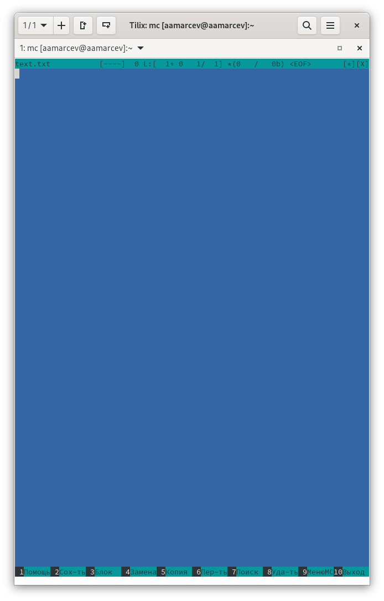
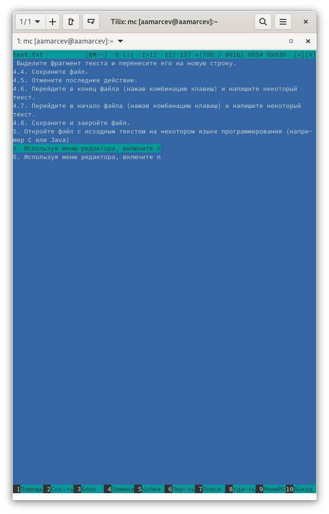
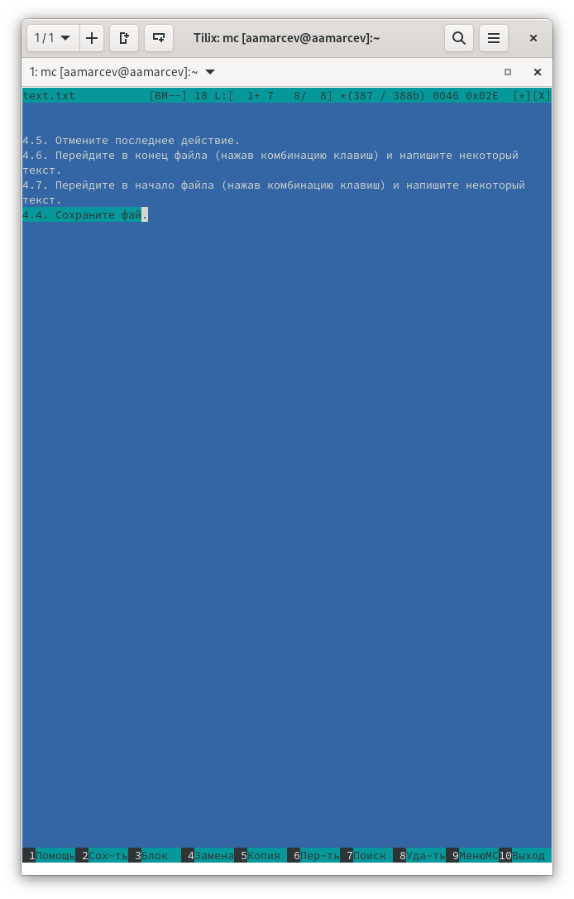
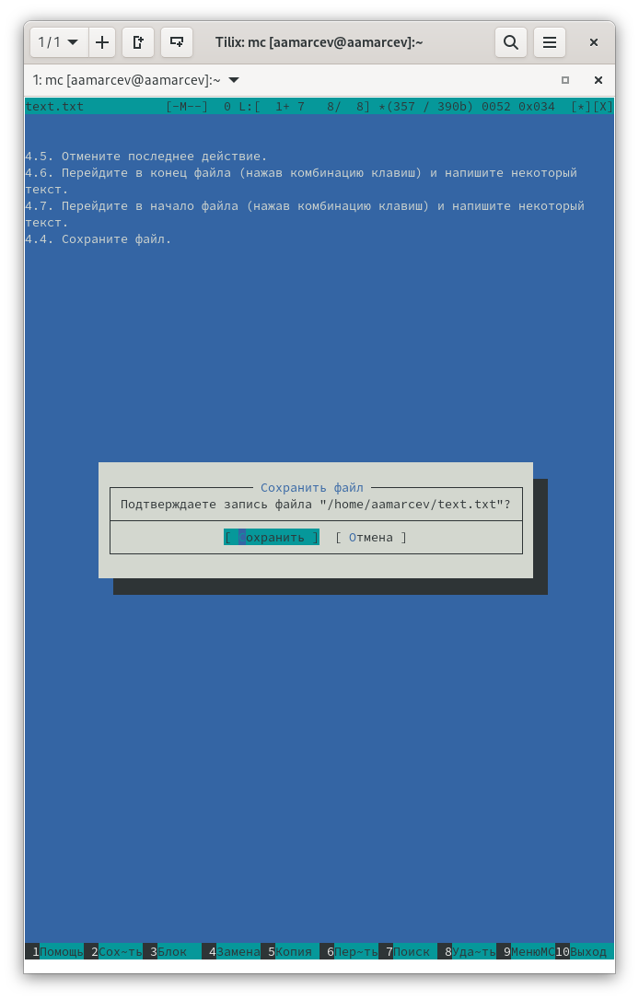
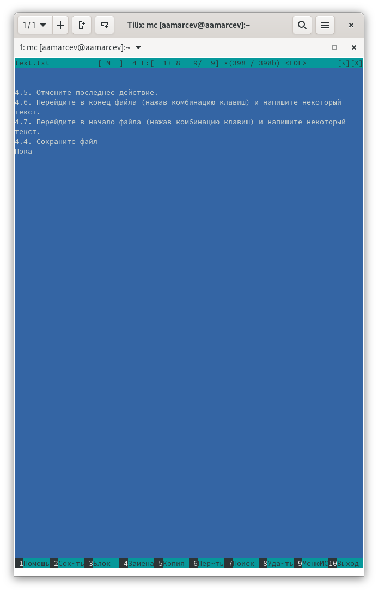
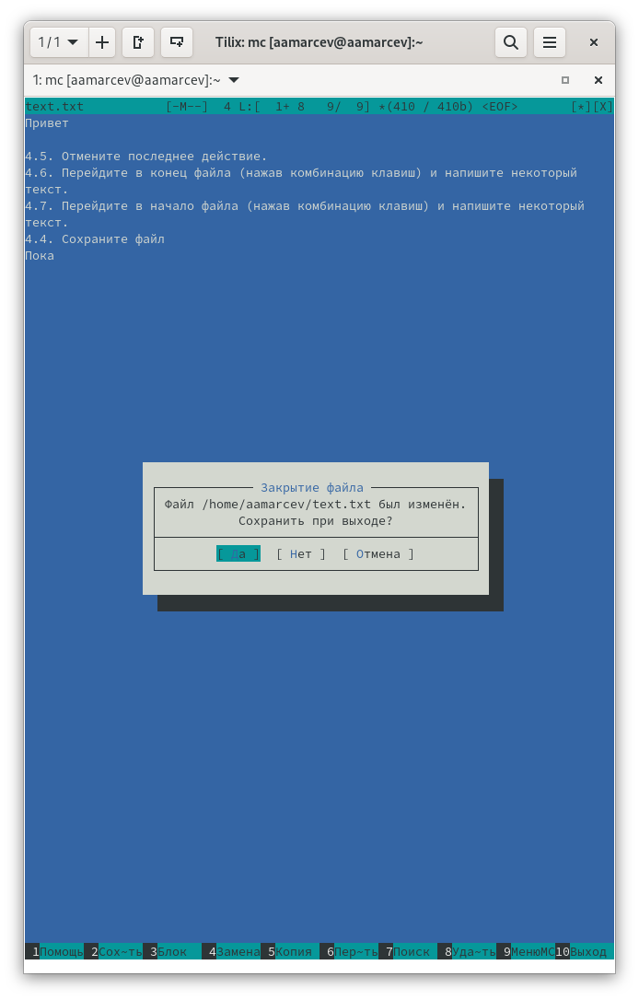
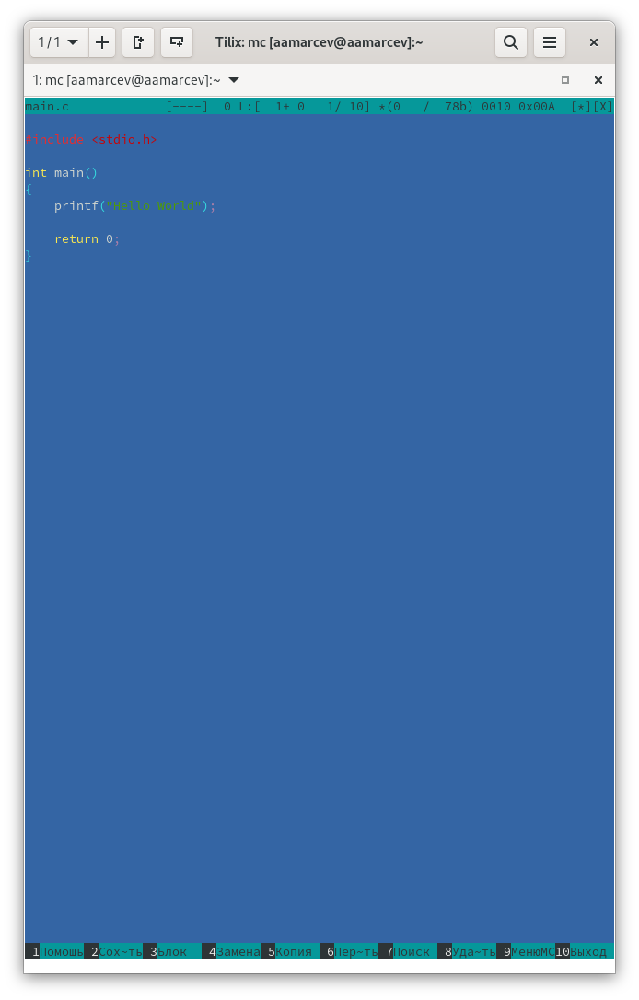
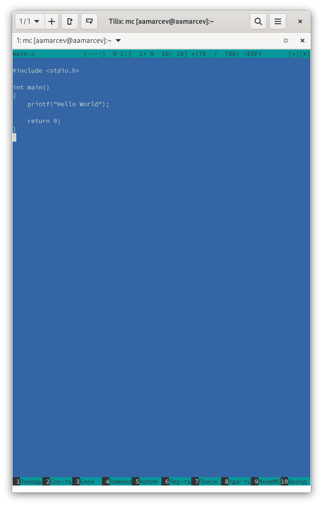

---
## Front matter
lang: ru-RU
title: Презентация к лабораторной работе №9
subtitle: Операционные системы
author:
  - Марцев А. А.
institute:
  - Российский университет дружбы народов, Москва, Россия
date: 06 апреля 2024

## i18n babel
babel-lang: russian
babel-otherlangs: english

## Formatting pdf
toc: false
toc-title: Содержание
slide_level: 2
aspectratio: 169
section-titles: true
theme: metropolis
header-includes:
 - \metroset{progressbar=frametitle,sectionpage=progressbar,numbering=fraction}
 - '\makeatletter'
 - '\beamer@ignorenonframefalse'
 - '\makeatother'
---

# Информация

## Докладчик

:::::::::::::: {.columns align=center}
::: {.column width="70%"}

  * Марцев Аркадий Алексеевич
  * Студент
  * Российский университет дружбы народов
  * 
  * <https://aamarcev.github.io/ru/>

:::
::: {.column width="30%"}

:::
::::::::::::::

# Вводная часть

## Актуальность

- Умение работать с удобной утилитой для работы с файлами через терминал Linux.
- Приобретение полезных практических навыков.
- Приобретение навыка, который поможет в для дальнейшей учебы.

## Объект и предмет исследования

- Утилита для работы с файлами через терминал Midnight Comander.

## Цели и задачи

- Освоение основных возможностей командной оболочки Midnight Commander. Приоб-
ретение навыков практической работы по просмотру каталогов и файлов; манипуляций
с ними.

# Выполнение лабораторной работы

## Откроем текстовый файл

Открываю заранее созданный текстовой файл text.txt.

{#fig:001 width=70%}

## Копирование строк

Выделяю строчку текста клавишей f3 и стрелками, копирую ее на новую строку функциональной клавишей f5.

{#fig:002 width=70%}

## Отмена последнего действия

Отменяю последнее действие сочетанием клавиш ctrl+u.

{#fig:003 width=70%}

## Сохранение файла

Сохраняю файл нажатием функциональной клавиши f2.

{#fig:004 width=70%}

## Перемещение по тексту

По тексту можно перемещаться не только при помощи мыши или стрелочек, но также и клавишами PgDn(Перейти в конец страницы) и PgUp(Перейти в начало страницы).

{#fig:005 width=70%}

## Закрытие файла

С помощью функциональной клавиши f10 выхожу из текстового редактора, перед этим mc предлагает сохранить изменения в файле.

{#fig:006 width=70%}

## Откроем файл с исходным кодом

Скачиваю файл написанный на языке программирования С и открываю его.

{#fig:007 width=70%}

## Взаимодействие с файлами с кодом

Отключаю подсветку текста при помощи сочетания клавиш ctrl+s.

{#fig:008 width=70%}

# Итог

## Вывод

В ходе выполнения этой лабораторной работы мы научились взаимодействовать с утилитой mc и использовать её горячие клавиши.

## Благодарность

Благодарю за внимание.

