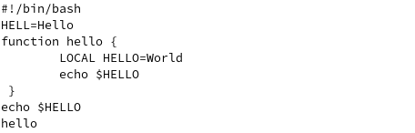
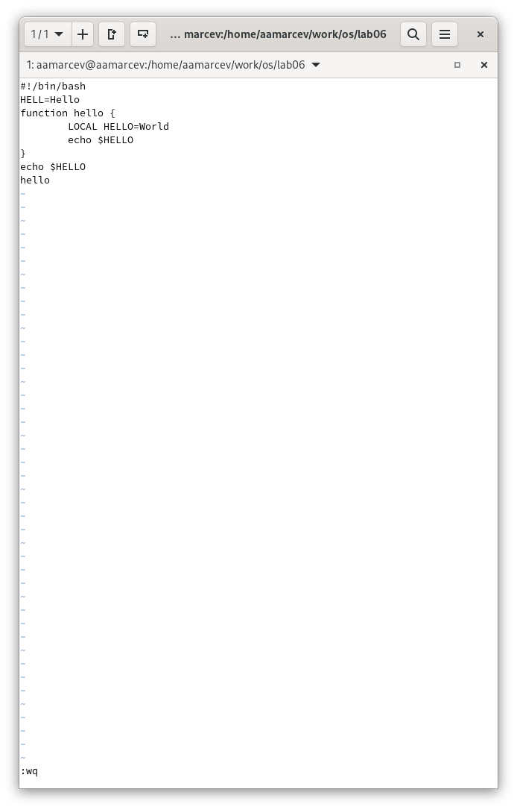
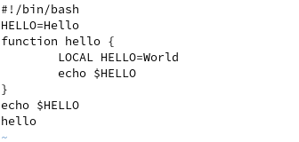
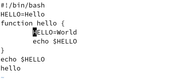
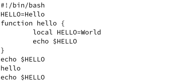
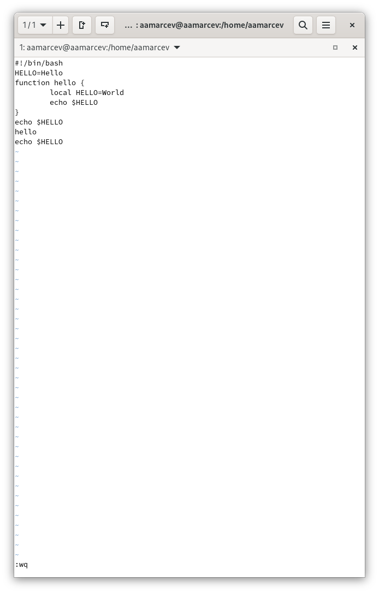

---
## Front matter
lang: ru-RU
title: Презентация по выполнению лабораторной работе №10
subtitle: Операционные системы
author:
  - Марцев А. А.
institute:
  - Российский университет дружбы народов, Москва, Россия
date: 09 апреля 2024

## i18n babel
babel-lang: russian
babel-otherlangs: english

## Formatting pdf
toc: false
toc-title: Содержание
slide_level: 2
aspectratio: 169
section-titles: true
theme: metropolis
header-includes:
 - \metroset{progressbar=frametitle,sectionpage=progressbar,numbering=fraction}
 - '\makeatletter'
 - '\beamer@ignorenonframefalse'
 - '\makeatother'
---

# Информация

## Докладчик

:::::::::::::: {.columns align=center}
::: {.column width="70%"}

  * Марцев Аркадий Алексеевич 
  * Студент
  * Российский университет дружбы народов
  * 
  * <https://aamarcev.github.io/ru/>

:::
::: {.column width="30%"}

:::
::::::::::::::

# Вводная часть

## Актуальность

- Приобретение практических навыков работы с утилитами Linux.
- Навык полезный для обучения.

## Объект и предмет исследования

- Текстовой редактор vi.
## Цели и задачи

- Познакомиться с операционной системой Linux. Получить практические навыки работы с редактором vi, установленным по умолчанию практически во всех дистрибутивах.

# Выполнение работы

##  Создание и открытие текстового файла

На данном слайде мы создаем текстовый файл при помощи vi и автоматически его открываем.

{#fig:001 width=70%}

## Вносим текст в файл

Добавляем текст в наш созданный ранее файл.

{#fig:002 width=70%}

## Закрываем и сохраняем файл 

Клавишей esc переходим в командный режим. Нажимаем клавишу : и прописываем :wq для того чтоб сохранить написанный файл и закрыть его.

{#fig:003 width=70%}

## Делаем файл исполняемым 

При помощи команды chmod и +x делаем файл hello.sh исполняемым.

{#fig:004 width=70%}

## Продолжаем редактировать файл

Снова заходим в ранее созданный файл. Ставим курсор в конец слова HELL и делаем из него HELLO. Клавишей esc снова перехожу в командный режим.

{#fig:005 width=70%}

## Используем горячие клавиши

Перевожу курсор на слово LOCAL удаляю его при помощи горячей клавиши.

{#fig:006 width=70%}

## Отменяем последнее изменение

Отменяю последнее действие при помощи клавиши U находясь в командном режиме.

{#fig:007 width=70%}

## Сохраняем и закрываем файл

Нажимаю клавишу : чтоб ввести команду для взаимодействия с файлом и прописываю :wq чтобы сохранить и закрыть файл.

{#fig:008 width=70%}

# Итог

## Выводы

    В ходе выполнения лабораторной работы мы приобрели практические навыки работы c текстовым редактором vi, который вcтроен почти в каждый дистрибутив Linux.

## Благодарность

    Благодарю за внимание.
