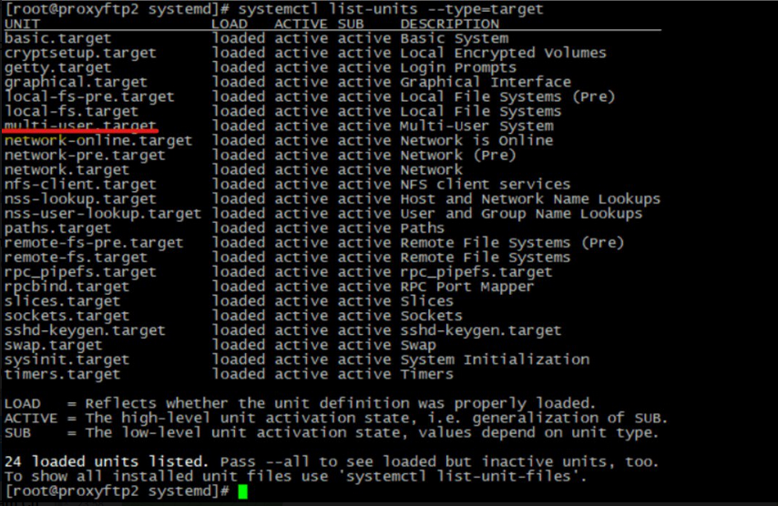
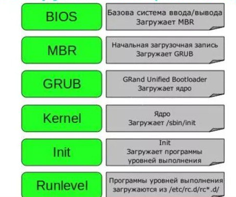

---
## Front matter
lang: ru-RU
title: Презентация по теме система инициализации Runinit.
subtitle: Операционные системы.
author:
  - Марцев А.А.
institute:
  - Российский университет дружбы народов, Москва, Россия
date: 01 мая 2024

## i18n babel
babel-lang: russian
babel-otherlangs: english

## Formatting pdf
toc: false
toc-title: Содержание
slide_level: 2
aspectratio: 169
section-titles: true
theme: metropolis
header-includes:
 - \metroset{progressbar=frametitle,sectionpage=progressbar,numbering=fraction}
 - '\makeatletter'
 - '\beamer@ignorenonframefalse'
 - '\makeatother'
---

# Информация

## Докладчик

:::::::::::::: {.columns align=center}
::: {.column width="70%"}

  * Марцев Аркадий Алексеевич
  * Студент
  * Компьютерные и информационные науки
  * Российский университет дружбы народов
  * [1132239100@pfur.ru](mailto:1132239100@pfur.ru)
  * <https://aamarcev.github.io/ru/>

:::
::: {.column width="30%"}

:::
::::::::::::::

# Вводная часть

## Объект и предмет исследования

- Система инициализации.
- Система инициализации Runinit.

## Актуальность

- Расширенное понимание работы ОС важно для качественного её администрирования.
- Углубленное понимание работы с процессами.
- Понимание современных систем инициализации.
- Понимание функционала системы инициализации Runinit.

## Теоретическое введение

- Система инициализации -- это набор скриптов(действий), которые выполняются сразу при запуске системы и запускают её внутренние процессы(демоны). 
У систем инициализации есть несколько аппаратных каталогов, которые используются для взаимодействия с процессами разного уровня.

## Каталоги инициализации

В рассматриваемой в этом докладе системе инициализации Runinit есть 7 каталогов с уровнями инициализации, которые используются для взаимодействия пользователя и системных процессов. Например уровень init 1(уровень одиночного пользователя) используется для решения административных задач, которые требуют режима супер-пользователя.
    
## Каталоги инициализации
    

# Система инициализации Runinit

## Этап запуска Runinit

Как мы видим на данном слайде, система инициализации процессов запускается в пятую очередь. На этом этапе и работает обсуждаемая сегодня система инициализации Runinit. Такой порядок запуска ОС Linux можно объяснить важностью того, что запускается на каждом этапе, например, на первом этапе запускается BIOS, который является утилитой для запуска загрузочного диска ОС. 

## Этап запуска Runinit

## Для чего создана Runinit

Runinit -- система инициализации которая была создана как более оптимизированный вариант популярной системы init. Так Runinit запускается быстрее и имеет расширенный функционал, благодаря этому она начала набирать популярность. Также Runinit кроссплатформена, что делает её доступной для пользователей MacOS, BSD, Linux. Подводя итог, Runinit -- более оптимизированная и быстрая система инициализации, с широким и удобным функционалом, которая доступна пользователям на множестве ОС.

## Особенности Runinit

У Runinit есть список ключевых особенностей, которые привлекают пользователей:
  -  Полный контроль сервисов, каждый сервис привязывается к своему каталогу;
  -  Надежное средство журналирования и ротации логов;
  -  Быстрая система загрузки и выключения;
  -  Портативность;
  -  Легкое создание файлов конфигурации служб;
  -  Небольшое количество кода системы инициализации.

## Журналирование и логи 

Журналирование -- запись всех событий в ходе определенного процесса в logfile. Журналирование важно, так как позволяет нам получить детальную информацию о процессах и, например, отследить ошибку которая происходит на определенном этапе. Так надежной журналирование -- это огромное преимущество Runinit. 

## Файлы конфигурации служб

Файлы конфигурации служб позволяют пользователю более детально настроить свою ОС и администрировать её. Так легкое их создание позволяет легче настраивать свою ОС и делать её работу более оптимизированной под каждого пользователя. На фото на слайде показана файловое дерево ОС Linux и где в нём находятся конфигурационные файлы системных служб. 

## Файлы конфигурации служб

# Заключение 

## Итог

Подводя итог, мы можем сказать, что Runinit удобная и функциональная система инициализации, которая обеспечивает быструю инициализацию системных процессов и удобную настройку конфигурации служб.

## Благодарность

Благодарю за внимание.
