---
## Front matter
title: "Отчет по выполнению 1-ого этапа инд. проекта"
subtitle: "Операционные системы"
author: "Марцев Аркадий Алексеевич"

## Generic otions
lang: ru-RU
toc-title: "Содержание"

## Bibliography
bibliography: bib/cite.bib
csl: pandoc/csl/gost-r-7-0-5-2008-numeric.csl

## Pdf output format
toc: true # Table of contents
toc-depth: 2
lof: true # List of figures
lot: true # List of tables
fontsize: 12pt
linestretch: 1.5
papersize: a4
documentclass: scrreprt
## I18n polyglossia
polyglossia-lang:
  name: russian
  options:
	- spelling=modern
	- babelshorthands=true
polyglossia-otherlangs:
  name: english
## I18n babel
babel-lang: russian
babel-otherlangs: english
## Fonts
mainfont: PT Serif
romanfont: PT Serif
sansfont: PT Sans
monofont: PT Mono
mainfontoptions: Ligatures=TeX
romanfontoptions: Ligatures=TeX
sansfontoptions: Ligatures=TeX,Scale=MatchLowercase
monofontoptions: Scale=MatchLowercase,Scale=0.9
## Biblatex
biblatex: true
biblio-style: "gost-numeric"
biblatexoptions:
  - parentracker=true
  - backend=biber
  - hyperref=auto
  - language=auto
  - autolang=other*
  - citestyle=gost-numeric
## Pandoc-crossref LaTeX customization
figureTitle: "Рис."
tableTitle: "Таблица"
listingTitle: "Листинг"
lofTitle: "Список иллюстраций"
lotTitle: "Список таблиц"
lolTitle: "Листинги"
## Misc options
indent: true
header-includes:
  - \usepackage{indentfirst}
  - \usepackage{float} # keep figures where there are in the text
  - \floatplacement{figure}{H} # keep figures where there are in the text
---

# Цель работы

Научиться пользоваться шаблоном для сайта hugo. Размещение своего сайта на gitpages

# Задание

1. Установить необходимое ПО
2. Скачать шаблон темы сайта 
3. Разместить его на хостинге git
4. Установить параметр для URLs сайта
5. Разместить заготовку сайта на Github

# Выполнение лабораторной работы
## Установка необходимого ПО

Скачиваю архив hugo и распаковываю его в заранее созданную папку bin 

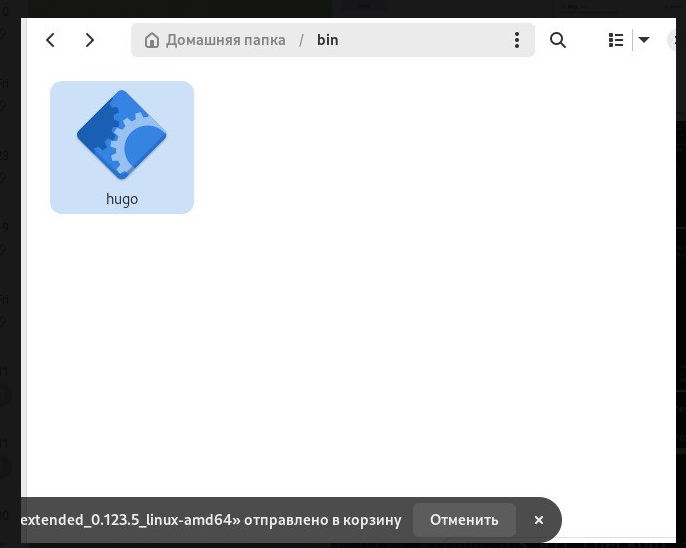{#fig:001 width=70%}

Копирую шаблон репозитория называю его blog. Клонирую его себе в директиву work через терминал.

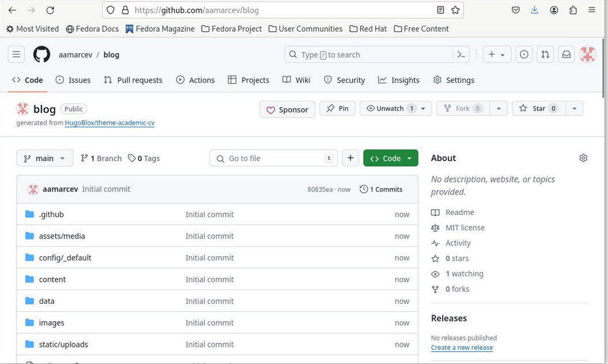{#fig:002 width=70%}

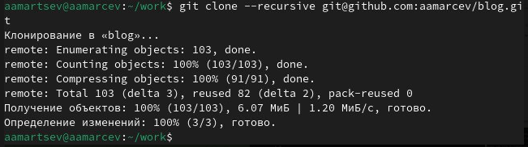{#fig:003 width=70%}

Далее я перехожу в репозиторий blog и активирую там hugo чтобы заполнились все данные сайта.

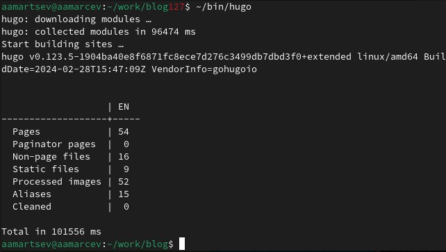{#fig:004 width=70%}

При помощи midnight comander удаляю папку public.

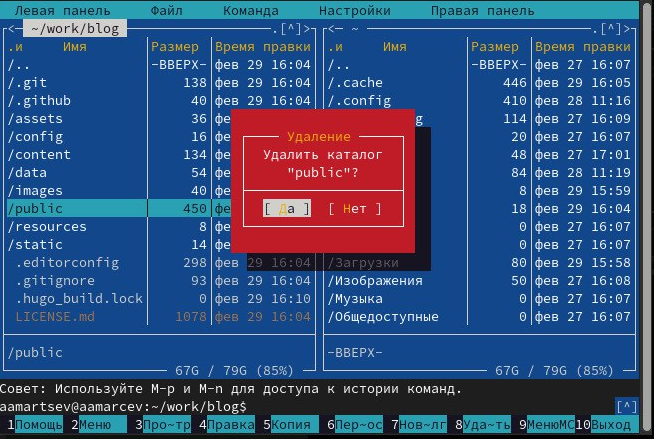{#fig:005 width=70%}

Создаю новый репозиторий в формате github pages, на котором в дальнейшем будет находиться мой сайт. называю его aamarcev.github.io. Далее клонирую этот репозиторий в папку work.

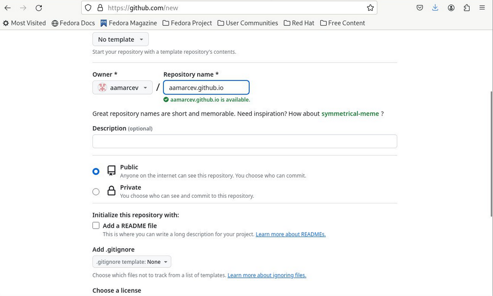{#fig:006 width=70%}

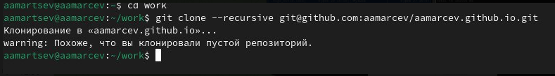{#fig:007 width=70%}

Перехожу в новый репозиторий и создаю ветку main.

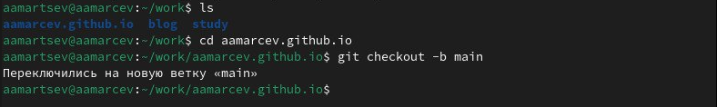{#fig:008 width=70%}

Создаю README.md файл и подгружаю его на гитхаб.

{#fig:009 width=70%}

'Закоменчиваю' public в файле конфигурации .gitignore чтобы позже это не мешало нам монтировать на эту папку сабмодуль.

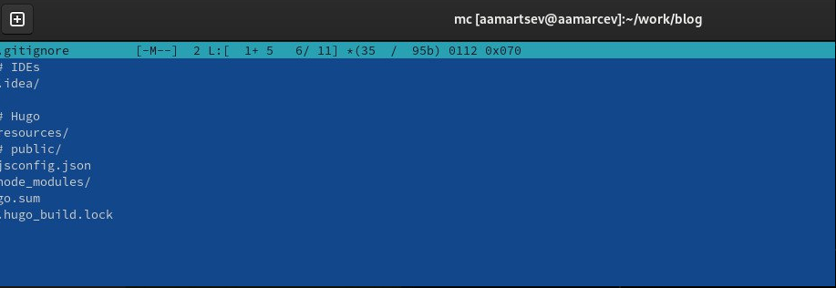{#fig:010 width=70%}

В репозитории blog изменяю файл hugo.yaml добавляя в специально выделенное поле URLs своего сайта.

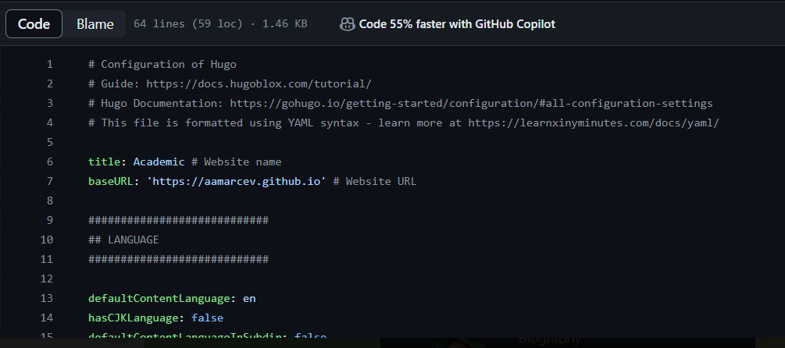{#fig:011 width=70%}

Прописываю команду submodle и монтируя её в свой проект.

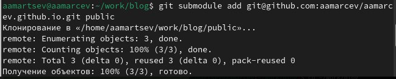{#fig:012 width=70%}

Заполняю папку public вызывая hugo. Отправляю все изменения в репозиторий своего сайта.

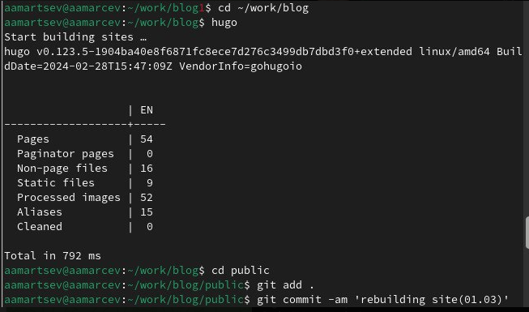{#fig:013 width=70%}

Проверяю свой сайт.

{#fig:014 width=70%}

# Выводы

Я научился пользоваться шаблоном hugo и созданием сайтов на git pages. Первый этап выполнен

# Список литературы{.unnumbered}

::: {#refs}
:::
