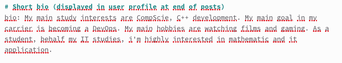

---
## Front matter
title: "Отчет о выполнении индивидуальный проект этап 2"
subtitle: "Операционные системы"
author: "Марцев Аркадий Алексеевич"

## Generic otions
lang: ru-RU
toc-title: "Содержание"

## Bibliography
bibliography: bib/cite.bib
csl: pandoc/csl/gost-r-7-0-5-2008-numeric.csl

## Pdf output format
toc: true # Table of contents
toc-depth: 2
lof: true # List of figures
lot: true # List of tables
fontsize: 12pt
linestretch: 1.5
papersize: a4
documentclass: scrreprt
## I18n polyglossia
polyglossia-lang:
  name: russian
  options:
	- spelling=modern
	- babelshorthands=true
polyglossia-otherlangs:
  name: english
## I18n babel
babel-lang: russian
babel-otherlangs: english
## Fonts
mainfont: PT Serif
romanfont: PT Serif
sansfont: PT Sans
monofont: PT Mono
mainfontoptions: Ligatures=TeX
romanfontoptions: Ligatures=TeX
sansfontoptions: Ligatures=TeX,Scale=MatchLowercase
monofontoptions: Scale=MatchLowercase,Scale=0.9
## Biblatex
biblatex: true
biblio-style: "gost-numeric"
biblatexoptions:
  - parentracker=true
  - backend=biber
  - hyperref=auto
  - language=auto
  - autolang=other*
  - citestyle=gost-numeric
## Pandoc-crossref LaTeX customization
figureTitle: "Рис."
tableTitle: "Таблица"
listingTitle: "Листинг"
lofTitle: "Список иллюстраций"
lotTitle: "Список таблиц"
lolTitle: "Листинги"
## Misc options
indent: true
header-includes:
  - \usepackage{indentfirst}
  - \usepackage{float} # keep figures where there are in the text
  - \floatplacement{figure}{H} # keep figures where there are in the text
---

# Цель работы

Добавление личной информации на свой сайт визитку. 

# Задание

-    Разместить фотографию владельца сайта.
-    Разместить краткое описание владельца сайта (Biography).
-    Добавить информацию об интересах (Interests).
-    Добавить информацию от образовании (Education).

Сделать пост по прошедшей неделе.
Добавить пост на тему по выбору:

-    Управление версиями. Git.
-    Непрерывная интеграция и непрерывное развертывание (CI/CD).

# Выполнение лабораторной работы

Для того чтоб добавить на сайт свою фотографию переходим в папку content/authors/admin удалям фото, которое там находится и добавляем свое.

{#fig:001 width=70%}

Открываем лежащий в этой же папке файл index.md и в нем заполняем информацию о имени владельца.

{#fig:002 width=70%}

Добавляем короткое био, информацию об интересах и образовании.

{#fig:003 width=70%}

{#fig:004 width=70%}

{#fig:005 width=70%}

Также добавляем полноценное био, которое будет отображаться на главной странице нашего сайта.

{#fig:006 width=70%}

На локально поднятом сайте проверяем, что все изменения вступили в силу.

{#fig:007 width=70%}

Создаем два новых поста. Один по прошедшей неделе, второй про непрерывную интеграцию и непрерывное развертывание (CI/CD).

{#fig:008 width=70%}

После заполнения проверяем, что они появились на сайте.

{#fig:009 width=70%}

Подгружаем все изменения в репозиторий с нашим сайтом через папку public и проверяем, что вся проделнная за сегодня работа появилась на сайте.

{#fig:010 width=70%}

# Выводы

В ходе выполнения второго этапа проекта мы добавили на сайт информацию о себе и создали два поста.

# Список литературы{.unnumbered}

::: {#refs}
:::
