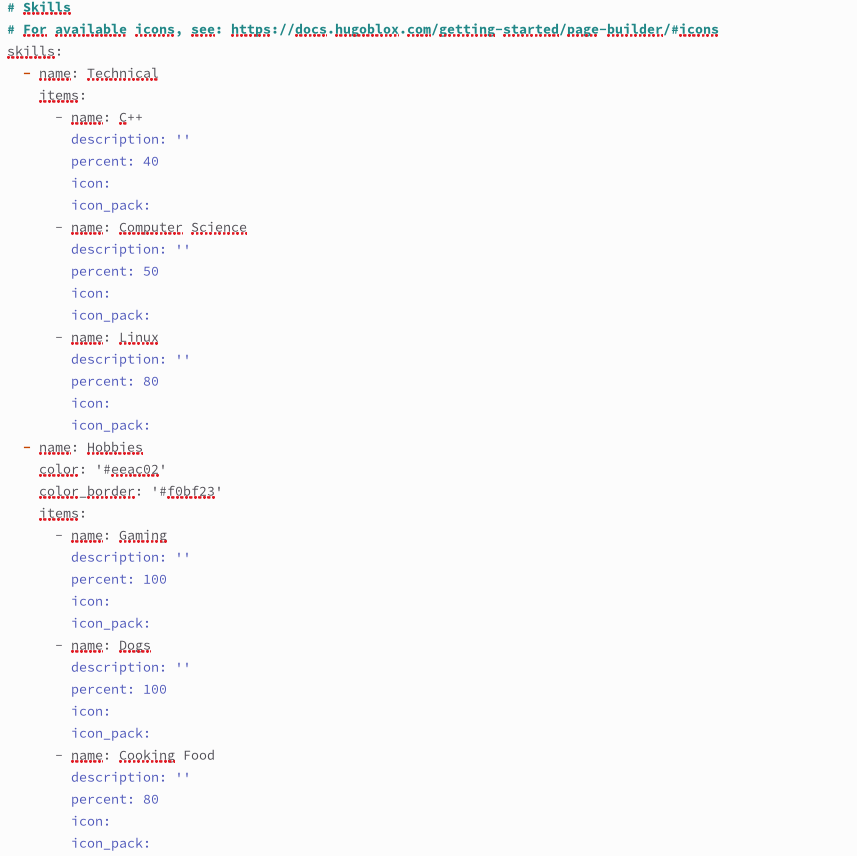
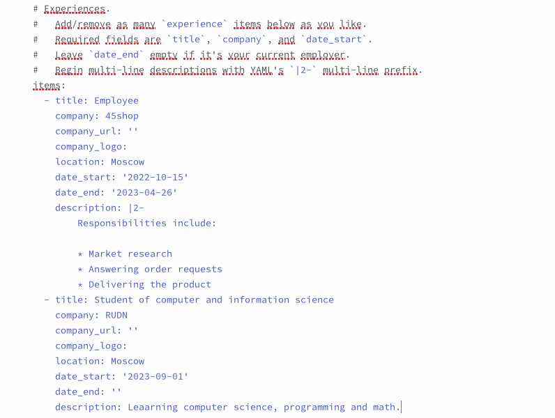
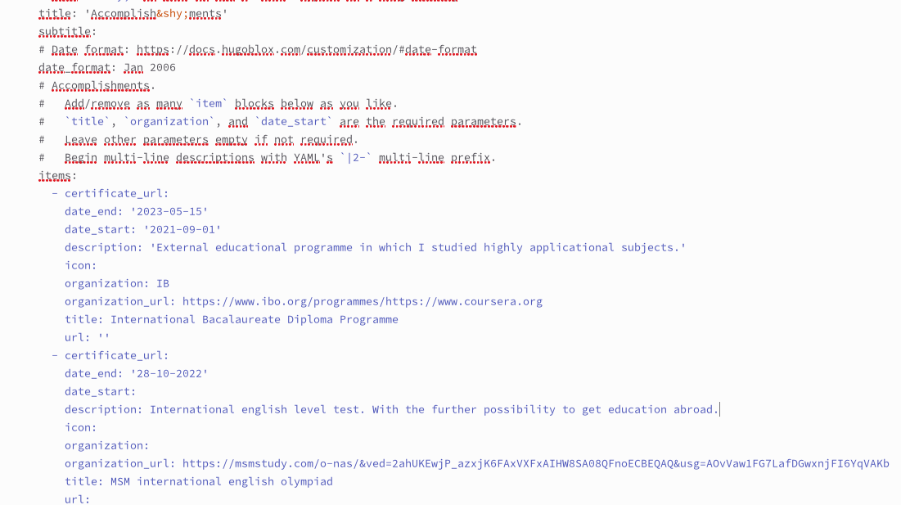
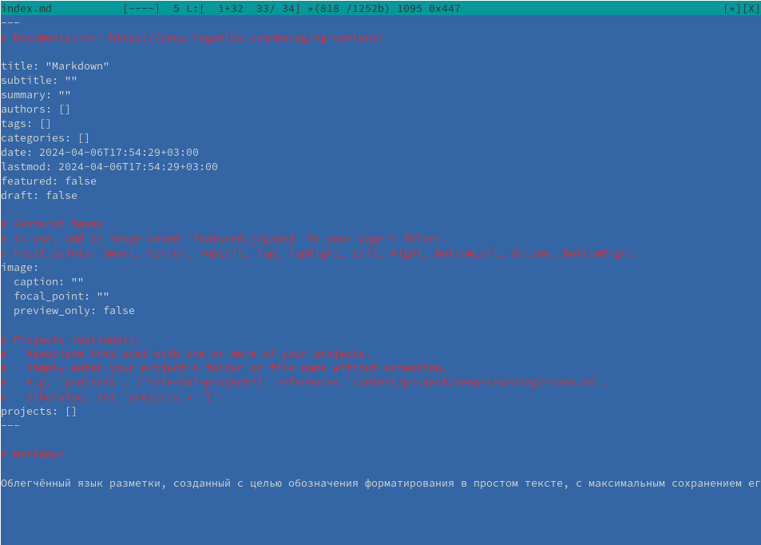
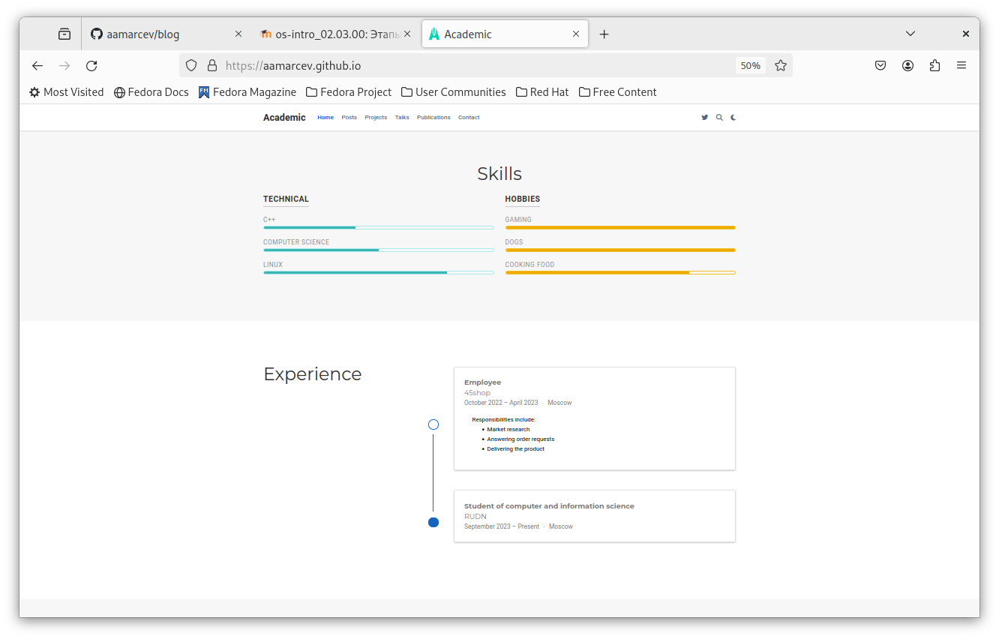

---
## Front matter
lang: ru-RU
title: Презентация по выполнению 3 этапа проекта
subtitle: Операционные системы
author:
  - Марцев Аркадий Алексеевич
institute:
  - Российский университет дружбы народов, Москва, Россия
date: 6 апреля 2024

## i18n babel
babel-lang: russian
babel-otherlangs: english

## Formatting pdf
toc: false
toc-title: Содержание
slide_level: 2
aspectratio: 169
section-titles: true
theme: metropolis
header-includes:
 - \metroset{progressbar=frametitle,sectionpage=progressbar,numbering=fraction}
 - '\makeatletter'
 - '\beamer@ignorenonframefalse'
 - '\makeatother'
---

# Информация

## Докладчик

:::::::::::::: {.columns align=center}
::: {.column width="70%"}

  * Марцев Аркадий Алексеевич
  * Студент
  * Российский университет дружбы народов
  * 
  * <https://aamarcev.github.io/ru/>

:::
::: {.column width="30%"}

:::
::::::::::::::

# Вводная часть

## Объект и предмет исследования

- Индивидуальный проект - сайт визитка научного работника

## Цели и задачи

- Добавить информацию о достижениях, навыках и опыте
- Создать два поста

# Выполнение работы

## Информация о навыках

Добавляю информацию о своих навыках.

{#fig:001 width=70%}

## Информация о опыте

Добавляю информацию о своем опыте.

{#fig:002 width=70%}

## Информация о достижениях

Добавляю информацию о своих достижениях.

{#fig:003 width=70%}

## Посты 

Создаю и заполняю пост о легковесном языке разметки Markdown, по аналогии делаю пост по прошедшей неделе.

{#fig:004 width=70%}

## Проверка изменений на сайте

Подгружаю все на github и проверяю изменения.

{#fig:006 width=70%}

# Итог

## Выводы

В ходе выполнения этой работы мы добавили на личный сайт некоторую информацию и создали два поста.

## Благодарность

Благодарю за внимание.
